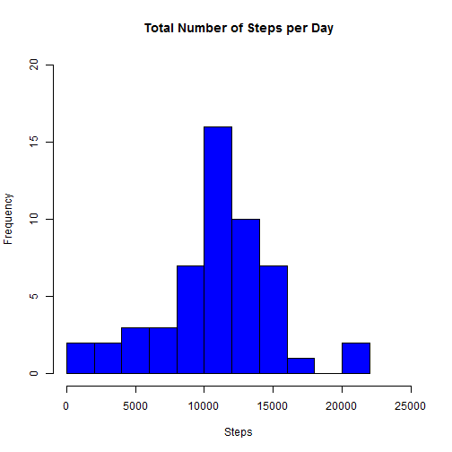
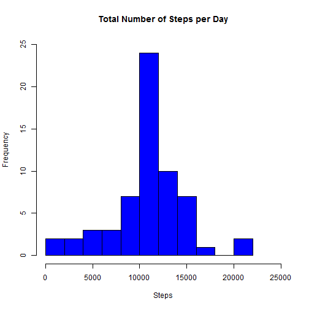

This is Peer Assignment 1 for Coursera's Reproducible Research course.

Load the data set.

```r
activity <- read.csv("~/Classes/Coursera/Data Science/05_Reproducible_Research/Assignment_01/repdata-data-activity/activity.csv")
library(dplyr)
tbl_df(activity)
```

```
## Source: local data frame [17,568 x 3]
## 
##    steps       date interval
## 1     NA 2012-10-01        0
## 2     NA 2012-10-01        5
## 3     NA 2012-10-01       10
## 4     NA 2012-10-01       15
## 5     NA 2012-10-01       20
## 6     NA 2012-10-01       25
## 7     NA 2012-10-01       30
## 8     NA 2012-10-01       35
## 9     NA 2012-10-01       40
## 10    NA 2012-10-01       45
## ..   ...        ...      ...
```

Calculate the total, mean and median number of steps taken per day.

```r
totalsteps<-aggregate(steps~date,activity,sum,na.rm=TRUE)
head(totalsteps)
```

```
##         date steps
## 1 2012-10-02   126
## 2 2012-10-03 11352
## 3 2012-10-04 12116
## 4 2012-10-05 13294
## 5 2012-10-06 15420
## 6 2012-10-07 11015
```

```r
meansteps<-mean(totalsteps$steps)
meansteps
```

```
## [1] 10766.19
```

```r
mediansteps<-median(totalsteps$steps)
mediansteps
```

```
## [1] 10765
```

Make a histogram of the total number of steps taken each day

```r
max(totalsteps$steps)
```

```
## [1] 21194
```

```r
hist(totalsteps$steps, main="Total Number of Steps per Day",xlab="Steps",ylab="Frequency",xlim=c(0,25000),ylim=c(0,20),breaks=10,col="blue")
```

 

Make a time series plot (i.e. type = "l") of the 5-minute interval (x-axis) and the average number of steps taken, averaged across all days (y-axis)

```r
stepsperinterval<-aggregate(steps~interval, activity, mean,na.rm=TRUE)
head(stepsperinterval)
```

```
##   interval     steps
## 1        0 1.7169811
## 2        5 0.3396226
## 3       10 0.1320755
## 4       15 0.1509434
## 5       20 0.0754717
## 6       25 2.0943396
```

```r
library(lattice)
xyplot(steps~interval,stepsperinterval,type="l")
```

 

Which 5-minute interval, on average across all the days in the dataset, contains the maximum number of steps?

```r
maxstepsinterval <- stepsperinterval[which.max(stepsperinterval$steps),]$interval
maxstepsinterval
```

```
## [1] 835
```

Calculate and report the total number of missing values in the dataset (i.e. the total number of rows with NAs)

```r
na <- sum(is.na(activity$steps))
na
```

```
## [1] 2304
```

Create a new dataset that is equal to the original dataset but with the missing data filled in.

```r
activityexna<-activity[complete.cases(activity),]
head(activityexna)
```

```
##     steps       date interval
## 289     0 2012-10-02        0
## 290     0 2012-10-02        5
## 291     0 2012-10-02       10
## 292     0 2012-10-02       15
## 293     0 2012-10-02       20
## 294     0 2012-10-02       25
```

```r
activityna<-activity[!complete.cases(activity),]
head(activityna)
```

```
##   steps       date interval
## 1    NA 2012-10-01        0
## 2    NA 2012-10-01        5
## 3    NA 2012-10-01       10
## 4    NA 2012-10-01       15
## 5    NA 2012-10-01       20
## 6    NA 2012-10-01       25
```

```r
temp<-merge(activityna,stepsperinterval,"interval")
head(temp)
```

```
##   interval steps.x       date  steps.y
## 1        0      NA 2012-10-01 1.716981
## 2        0      NA 2012-11-30 1.716981
## 3        0      NA 2012-11-04 1.716981
## 4        0      NA 2012-11-09 1.716981
## 5        0      NA 2012-11-14 1.716981
## 6        0      NA 2012-11-10 1.716981
```

```r
temp2<-select(temp,steps.y,date,interval)
head(temp2)
```

```
##    steps.y       date interval
## 1 1.716981 2012-10-01        0
## 2 1.716981 2012-11-30        0
## 3 1.716981 2012-11-04        0
## 4 1.716981 2012-11-09        0
## 5 1.716981 2012-11-14        0
## 6 1.716981 2012-11-10        0
```

```r
library(plyr)
temp3<-rename(temp2,c("steps.y"="steps"))
head(temp3)
```

```
##      steps       date interval
## 1 1.716981 2012-10-01        0
## 2 1.716981 2012-11-30        0
## 3 1.716981 2012-11-04        0
## 4 1.716981 2012-11-09        0
## 5 1.716981 2012-11-14        0
## 6 1.716981 2012-11-10        0
```

```r
newactivity<-bind_rows(activityexna,temp3)
arrange(newactivity,date)
```

```
## Source: local data frame [17,568 x 3]
## 
##        steps       date interval
## 1  1.7169811 2012-10-01        0
## 2  0.3396226 2012-10-01        5
## 3  0.1320755 2012-10-01       10
## 4  0.1509434 2012-10-01       15
## 5  0.0754717 2012-10-01       20
## 6  2.0943396 2012-10-01       25
## 7  0.5283019 2012-10-01       30
## 8  0.8679245 2012-10-01       35
## 9  0.0000000 2012-10-01       40
## 10 1.4716981 2012-10-01       45
## ..       ...        ...      ...
```

Make a histogram of the total number of steps taken each day and Calculate and report the mean and median total number of steps taken per day. Do these values differ from the estimates from the first part of the assignment? ~ Mean is the same but Median differs. What is the impact of imputing missing data on the estimates of the total daily number of steps? ~ sum(newtotalsteps$steps) > sum(totalsteps$steps)

```r
newtotalsteps<-aggregate(steps~date,newactivity,sum)
head(newtotalsteps)
```

```
##         date    steps
## 1 2012-10-01 10766.19
## 2 2012-10-02   126.00
## 3 2012-10-03 11352.00
## 4 2012-10-04 12116.00
## 5 2012-10-05 13294.00
## 6 2012-10-06 15420.00
```

```r
newmeansteps<-mean(newtotalsteps$steps)
newmeansteps
```

```
## [1] 10766.19
```

```r
newmediansteps<-median(newtotalsteps$steps)
newmediansteps
```

```
## [1] 10766.19
```

```r
sum(newtotalsteps$steps)
```

```
## [1] 656737.5
```

```r
sum(totalsteps$steps)
```

```
## [1] 570608
```

```r
max(newtotalsteps$steps)
```

```
## [1] 21194
```

```r
hist(newtotalsteps$steps, main="Total Number of Steps per Day",xlab="Steps",ylab="Frequency",xlim=c(0,25000),ylim=c(0,25),breaks=10,col="blue")
```

 

For this part the weekdays() function may be of some help here. Use the dataset with the filled-in missing values for this part.

Create a new factor variable in the dataset with two levels - "weekday" and "weekend" indicating whether a given date is a weekday or weekend day.

```r
newactivity<-mutate(newactivity,day=weekdays(as.Date(newactivity$date)))
head(newactivity)
```

```
## Source: local data frame [6 x 4]
## 
##   steps       date interval     day
## 1     0 2012-10-02        0 Tuesday
## 2     0 2012-10-02        5 Tuesday
## 3     0 2012-10-02       10 Tuesday
## 4     0 2012-10-02       15 Tuesday
## 5     0 2012-10-02       20 Tuesday
## 6     0 2012-10-02       25 Tuesday
```

```r
reference<-matrix(c('Saturday', 'Sunday','Monday','Tuesday','Wednesday','Thursday','Friday','weekend','weekend','weekday','weekday','weekday','weekday','weekday'),ncol=2)
colnames(reference)<-c('day','daytype')
reference<-as.data.frame(reference)
activitydaytype<-merge(newactivity,reference,"day")
head(activitydaytype)
```

```
##      day steps       date interval daytype
## 1 Friday     0 2012-11-23     2135 weekday
## 2 Friday   168 2012-10-19     1650 weekday
## 3 Friday    15 2012-10-26      830 weekday
## 4 Friday   257 2012-10-26     1835 weekday
## 5 Friday     0 2012-10-26     1720 weekday
## 6 Friday     0 2012-11-30      120 weekday
```

```r
activitydaytype<-activitydaytype[c("steps","date","interval","day","daytype")]
arrange(activitydaytype,date)
```

```
##             steps       date interval       day daytype
## 1       1.7169811 2012-10-01        0    Monday weekday
## 2       0.1320755 2012-10-01       10    Monday weekday
## 3       0.3207547 2012-10-01      100    Monday weekday
## 4       0.0754717 2012-10-01       20    Monday weekday
## 5       0.2075472 2012-10-01      320    Monday weekday
## 6       0.4905660 2012-10-01      340    Monday weekday
## 7       0.0000000 2012-10-01      350    Monday weekday
## 8       0.0000000 2012-10-01      355    Monday weekday
## 9       0.0000000 2012-10-01      310    Monday weekday
## 10      3.4905660 2012-10-01      440    Monday weekday
## 11      0.8301887 2012-10-01      445    Monday weekday
## 12      3.1132075 2012-10-01      450    Monday weekday
## 13      1.1132075 2012-10-01      455    Monday weekday
## 14      0.0000000 2012-10-01      305    Monday weekday
## 15      0.8679245 2012-10-01       35    Monday weekday
## 16      4.1132075 2012-10-01      430    Monday weekday
## 17     63.4528302 2012-10-01      615    Monday weekday
## 18     49.9622642 2012-10-01      620    Monday weekday
## 19      0.0000000 2012-10-01      245    Monday weekday
## 20     44.0188679 2012-10-01      640    Monday weekday
## 21      0.9433962 2012-10-01      255    Monday weekday
## 22      0.0000000 2012-10-01      300    Monday weekday
## 23     37.3584906 2012-10-01      650    Monday weekday
## 24     49.0377358 2012-10-01      655    Monday weekday
## 25     44.3773585 2012-10-01      705    Monday weekday
## 26     50.5094340 2012-10-01      710    Monday weekday
## 27      0.6226415 2012-10-01      325    Monday weekday
## 28     54.5094340 2012-10-01      715    Monday weekday
## 29      1.6226415 2012-10-01      330    Monday weekday
## 30     49.9245283 2012-10-01      720    Monday weekday
## 31      0.5849057 2012-10-01      335    Monday weekday
## 32     50.9811321 2012-10-01      725    Monday weekday
## 33     55.6792453 2012-10-01      730    Monday weekday
## 34      0.0754717 2012-10-01      345    Monday weekday
## 35     44.3207547 2012-10-01      735    Monday weekday
## 36     52.2641509 2012-10-01      740    Monday weekday
## 37     69.5471698 2012-10-01      745    Monday weekday
## 38      1.1886792 2012-10-01      400    Monday weekday
## 39     57.8490566 2012-10-01      750    Monday weekday
## 40      0.9433962 2012-10-01      405    Monday weekday
## 41      2.5660377 2012-10-01      410    Monday weekday
## 42     56.1509434 2012-10-01      755    Monday weekday
## 43     73.3773585 2012-10-01      800    Monday weekday
## 44     68.2075472 2012-10-01      805    Monday weekday
## 45    129.4339623 2012-10-01      810    Monday weekday
## 46     43.8113208 2012-10-01      700    Monday weekday
## 47    157.5283019 2012-10-01      815    Monday weekday
## 48      0.0000000 2012-10-01      315    Monday weekday
## 49      0.6603774 2012-10-01      435    Monday weekday
## 50    155.3962264 2012-10-01      825    Monday weekday
## 51    177.3018868 2012-10-01      830    Monday weekday
## 52    206.1698113 2012-10-01      835    Monday weekday
## 53    195.9245283 2012-10-01      840    Monday weekday
## 54    179.5660377 2012-10-01      845    Monday weekday
## 55      0.0000000 2012-10-01      500    Monday weekday
## 56    183.3962264 2012-10-01      850    Monday weekday
## 57      1.5660377 2012-10-01      505    Monday weekday
## 58      0.0000000 2012-10-01      415    Monday weekday
## 59      0.3396226 2012-10-01      420    Monday weekday
## 60      0.3584906 2012-10-01      425    Monday weekday
## 61    171.1509434 2012-10-01      820    Monday weekday
## 62     39.4528302 2012-10-01      550    Monday weekday
## 63      1.1320755 2012-10-01      210    Monday weekday
## 64      0.0000000 2012-10-01      215    Monday weekday
## 65     34.9811321 2012-10-01      950    Monday weekday
## 66     49.2641509 2012-10-01      605    Monday weekday
## 67      0.1320755 2012-10-01      225    Monday weekday
## 68     26.9811321 2012-10-01     1005    Monday weekday
## 69     42.4150943 2012-10-01     1010    Monday weekday
## 70      0.2264151 2012-10-01      235    Monday weekday
## 71     47.0754717 2012-10-01      625    Monday weekday
## 72     52.6603774 2012-10-01     1015    Monday weekday
## 73      0.0000000 2012-10-01      240    Monday weekday
## 74     52.1509434 2012-10-01      630    Monday weekday
## 75     38.9245283 2012-10-01     1020    Monday weekday
## 76     39.3396226 2012-10-01      635    Monday weekday
## 77     50.7924528 2012-10-01     1025    Monday weekday
## 78      1.5471698 2012-10-01      250    Monday weekday
## 79     44.2830189 2012-10-01     1030    Monday weekday
## 80     44.1698113 2012-10-01      645    Monday weekday
## 81     37.4150943 2012-10-01     1035    Monday weekday
## 82     34.6981132 2012-10-01     1040    Monday weekday
## 83     28.3396226 2012-10-01     1045    Monday weekday
## 84     25.0943396 2012-10-01     1050    Monday weekday
## 85     31.9433962 2012-10-01     1055    Monday weekday
## 86     31.3584906 2012-10-01     1100    Monday weekday
## 87     29.6792453 2012-10-01     1105    Monday weekday
## 88     21.3207547 2012-10-01     1110    Monday weekday
## 89     25.5471698 2012-10-01     1115    Monday weekday
## 90     28.3773585 2012-10-01     1120    Monday weekday
## 91     26.4716981 2012-10-01     1125    Monday weekday
## 92      0.3396226 2012-10-01        5    Monday weekday
## 93     33.4339623 2012-10-01     1130    Monday weekday
## 94     49.9811321 2012-10-01     1135    Monday weekday
## 95     42.0377358 2012-10-01     1140    Monday weekday
## 96      0.1509434 2012-10-01       15    Monday weekday
## 97     44.6037736 2012-10-01     1145    Monday weekday
## 98      2.0943396 2012-10-01       25    Monday weekday
## 99     46.0377358 2012-10-01     1150    Monday weekday
## 100     0.5283019 2012-10-01       30    Monday weekday
## 101    59.1886792 2012-10-01     1155    Monday weekday
## 102    63.8679245 2012-10-01     1200    Monday weekday
## 103     0.0000000 2012-10-01       40    Monday weekday
## 104     1.4716981 2012-10-01       45    Monday weekday
## 105    87.6981132 2012-10-01     1205    Monday weekday
## 106    94.8490566 2012-10-01     1210    Monday weekday
## 107     0.3018868 2012-10-01       50    Monday weekday
## 108    92.7735849 2012-10-01     1215    Monday weekday
## 109     0.1320755 2012-10-01       55    Monday weekday
## 110    63.3962264 2012-10-01     1220    Monday weekday
## 111    50.1698113 2012-10-01     1225    Monday weekday
## 112     0.6792453 2012-10-01      105    Monday weekday
## 113    54.4716981 2012-10-01     1230    Monday weekday
## 114     0.1509434 2012-10-01      110    Monday weekday
## 115    32.4150943 2012-10-01     1235    Monday weekday
## 116     0.3396226 2012-10-01      115    Monday weekday
## 117    26.5283019 2012-10-01     1240    Monday weekday
## 118     0.0000000 2012-10-01      120    Monday weekday
## 119    37.7358491 2012-10-01     1245    Monday weekday
## 120     3.0000000 2012-10-01      510    Monday weekday
## 121    45.0566038 2012-10-01     1250    Monday weekday
## 122     2.9622642 2012-10-01      525    Monday weekday
## 123    46.2452830 2012-10-01     1320    Monday weekday
## 124     0.0000000 2012-10-01      205    Monday weekday
## 125    42.7547170 2012-10-01     1330    Monday weekday
## 126    31.4905660 2012-10-01      600    Monday weekday
## 127    53.5471698 2012-10-01     1345    Monday weekday
## 128     0.0000000 2012-10-01      220    Monday weekday
## 129    21.0566038 2012-10-01      955    Monday weekday
## 130    53.7735849 2012-10-01      610    Monday weekday
## 131    47.3207547 2012-10-01     1350    Monday weekday
## 132     0.0000000 2012-10-01      230    Monday weekday
## 133    60.8113208 2012-10-01     1355    Monday weekday
## 134    55.7547170 2012-10-01     1400    Monday weekday
## 135    51.9622642 2012-10-01     1405    Monday weekday
## 136    43.5849057 2012-10-01     1410    Monday weekday
## 137    48.6981132 2012-10-01     1415    Monday weekday
## 138    35.4716981 2012-10-01     1420    Monday weekday
## 139    37.5471698 2012-10-01     1425    Monday weekday
## 140    41.8490566 2012-10-01     1430    Monday weekday
## 141    27.5094340 2012-10-01     1435    Monday weekday
## 142    17.1132075 2012-10-01     1440    Monday weekday
## 143    26.0754717 2012-10-01     1445    Monday weekday
## 144    43.6226415 2012-10-01     1450    Monday weekday
## 145    43.7735849 2012-10-01     1455    Monday weekday
## 146    30.0188679 2012-10-01     1500    Monday weekday
## 147    36.0754717 2012-10-01     1505    Monday weekday
## 148    35.4905660 2012-10-01     1510    Monday weekday
## 149    38.8490566 2012-10-01     1515    Monday weekday
## 150    45.9622642 2012-10-01     1520    Monday weekday
## 151    47.7547170 2012-10-01     1525    Monday weekday
## 152    48.1320755 2012-10-01     1530    Monday weekday
## 153    65.3207547 2012-10-01     1535    Monday weekday
## 154    82.9056604 2012-10-01     1540    Monday weekday
## 155    98.6603774 2012-10-01     1545    Monday weekday
## 156   102.1132075 2012-10-01     1550    Monday weekday
## 157    83.9622642 2012-10-01     1555    Monday weekday
## 158    62.1320755 2012-10-01     1600    Monday weekday
## 159    64.1320755 2012-10-01     1605    Monday weekday
## 160    74.5471698 2012-10-01     1610    Monday weekday
## 161    63.1698113 2012-10-01     1615    Monday weekday
## 162    56.9056604 2012-10-01     1620    Monday weekday
## 163    59.7735849 2012-10-01     1625    Monday weekday
## 164     1.1132075 2012-10-01      125    Monday weekday
## 165    38.5660377 2012-10-01     1635    Monday weekday
## 166     1.8301887 2012-10-01      130    Monday weekday
## 167   124.0377358 2012-10-01      905    Monday weekday
## 168    67.2830189 2012-10-01     1255    Monday weekday
## 169     0.1698113 2012-10-01      135    Monday weekday
## 170   108.1132075 2012-10-01      915    Monday weekday
## 171    42.3396226 2012-10-01     1300    Monday weekday
## 172    46.2075472 2012-10-01     1650    Monday weekday
## 173     0.3773585 2012-10-01      145    Monday weekday
## 174     2.0943396 2012-10-01      530    Monday weekday
## 175    43.6792453 2012-10-01     1655    Monday weekday
## 176    43.2641509 2012-10-01     1310    Monday weekday
## 177     6.0566038 2012-10-01      535    Monday weekday
## 178    46.6226415 2012-10-01     1700    Monday weekday
## 179     0.2641509 2012-10-01      150    Monday weekday
## 180    40.9811321 2012-10-01     1315    Monday weekday
## 181    16.0188679 2012-10-01      540    Monday weekday
## 182    50.7169811 2012-10-01     1710    Monday weekday
## 183    61.2264151 2012-10-01     1715    Monday weekday
## 184    44.4905660 2012-10-01      555    Monday weekday
## 185    25.1320755 2012-10-01     1335    Monday weekday
## 186    78.9433962 2012-10-01     1725    Monday weekday
## 187    39.9622642 2012-10-01     1340    Monday weekday
## 188    75.0943396 2012-10-01     1740    Monday weekday
## 189    56.5094340 2012-10-01     1745    Monday weekday
## 190    34.7735849 2012-10-01     1750    Monday weekday
## 191    37.4528302 2012-10-01     1755    Monday weekday
## 192    40.6792453 2012-10-01     1800    Monday weekday
## 193    58.0188679 2012-10-01     1805    Monday weekday
## 194    74.6981132 2012-10-01     1810    Monday weekday
## 195    85.3207547 2012-10-01     1815    Monday weekday
## 196    59.2641509 2012-10-01     1820    Monday weekday
## 197    67.7735849 2012-10-01     1825    Monday weekday
## 198    77.6981132 2012-10-01     1830    Monday weekday
## 199    74.2452830 2012-10-01     1835    Monday weekday
## 200    85.3396226 2012-10-01     1840    Monday weekday
## 201    99.4528302 2012-10-01     1845    Monday weekday
## 202    86.5849057 2012-10-01     1850    Monday weekday
## 203    85.6037736 2012-10-01     1855    Monday weekday
## 204    84.8679245 2012-10-01     1900    Monday weekday
## 205    77.8301887 2012-10-01     1905    Monday weekday
## 206    58.0377358 2012-10-01     1910    Monday weekday
## 207    53.3584906 2012-10-01     1915    Monday weekday
## 208    36.3207547 2012-10-01     1920    Monday weekday
## 209    20.7169811 2012-10-01     1925    Monday weekday
## 210    27.3962264 2012-10-01     1930    Monday weekday
## 211    40.0188679 2012-10-01     1935    Monday weekday
## 212    30.2075472 2012-10-01     1940    Monday weekday
## 213    25.5471698 2012-10-01     1945    Monday weekday
## 214    45.6603774 2012-10-01     1950    Monday weekday
## 215    33.5283019 2012-10-01     1955    Monday weekday
## 216    19.6226415 2012-10-01     2000    Monday weekday
## 217    19.0188679 2012-10-01     2005    Monday weekday
## 218    19.3396226 2012-10-01     2010    Monday weekday
## 219    33.3396226 2012-10-01     2015    Monday weekday
## 220    26.8113208 2012-10-01     2020    Monday weekday
## 221    43.8679245 2012-10-01     1630    Monday weekday
## 222   167.0188679 2012-10-01      855    Monday weekday
## 223    21.1698113 2012-10-01     2025    Monday weekday
## 224   143.4528302 2012-10-01      900    Monday weekday
## 225     2.2452830 2012-10-01      515    Monday weekday
## 226    44.6603774 2012-10-01     1640    Monday weekday
## 227    27.3018868 2012-10-01     2030    Monday weekday
## 228     3.3207547 2012-10-01      520    Monday weekday
## 229    45.4528302 2012-10-01     1645    Monday weekday
## 230   109.1132075 2012-10-01      910    Monday weekday
## 231    21.3396226 2012-10-01     2035    Monday weekday
## 232    19.5471698 2012-10-01     2040    Monday weekday
## 233     0.1698113 2012-10-01      140    Monday weekday
## 234    39.8867925 2012-10-01     1305    Monday weekday
## 235   103.7169811 2012-10-01      920    Monday weekday
## 236    21.3207547 2012-10-01     2045    Monday weekday
## 237    95.9622642 2012-10-01      925    Monday weekday
## 238    32.3018868 2012-10-01     2050    Monday weekday
## 239     0.0000000 2012-10-01      155    Monday weekday
## 240    56.3018868 2012-10-01     1705    Monday weekday
## 241    18.3396226 2012-10-01      545    Monday weekday
## 242    66.2075472 2012-10-01      930    Monday weekday
## 243     0.0000000 2012-10-01      200    Monday weekday
## 244    20.1509434 2012-10-01     2055    Monday weekday
## 245    45.2264151 2012-10-01      935    Monday weekday
## 246    56.4339623 2012-10-01     1325    Monday weekday
## 247    15.9433962 2012-10-01     2100    Monday weekday
## 248    17.2264151 2012-10-01     2105    Monday weekday
## 249    24.7924528 2012-10-01      940    Monday weekday
## 250    72.7169811 2012-10-01     1720    Monday weekday
## 251    38.7547170 2012-10-01      945    Monday weekday
## 252    23.4528302 2012-10-01     2110    Monday weekday
## 253    19.2452830 2012-10-01     2115    Monday weekday
## 254    68.9433962 2012-10-01     1730    Monday weekday
## 255    12.4528302 2012-10-01     2120    Monday weekday
## 256    59.6603774 2012-10-01     1735    Monday weekday
## 257    40.5660377 2012-10-01     1000    Monday weekday
## 258     8.0188679 2012-10-01     2125    Monday weekday
## 259    14.6603774 2012-10-01     2130    Monday weekday
## 260    16.3018868 2012-10-01     2135    Monday weekday
## 261     8.6792453 2012-10-01     2140    Monday weekday
## 262     7.7924528 2012-10-01     2145    Monday weekday
## 263     8.1320755 2012-10-01     2150    Monday weekday
## 264     2.6226415 2012-10-01     2155    Monday weekday
## 265     1.4528302 2012-10-01     2200    Monday weekday
## 266     3.6792453 2012-10-01     2205    Monday weekday
## 267     4.8113208 2012-10-01     2210    Monday weekday
## 268     8.5094340 2012-10-01     2215    Monday weekday
## 269     7.0754717 2012-10-01     2220    Monday weekday
## 270     8.6981132 2012-10-01     2225    Monday weekday
## 271     9.7547170 2012-10-01     2230    Monday weekday
## 272     2.2075472 2012-10-01     2235    Monday weekday
## 273     0.3207547 2012-10-01     2240    Monday weekday
## 274     0.1132075 2012-10-01     2245    Monday weekday
## 275     1.6037736 2012-10-01     2250    Monday weekday
## 276     4.6037736 2012-10-01     2255    Monday weekday
## 277     3.3018868 2012-10-01     2300    Monday weekday
## 278     2.8490566 2012-10-01     2305    Monday weekday
## 279     0.0000000 2012-10-01     2310    Monday weekday
## 280     0.8301887 2012-10-01     2315    Monday weekday
## 281     0.9622642 2012-10-01     2320    Monday weekday
## 282     1.5849057 2012-10-01     2325    Monday weekday
## 283     2.6037736 2012-10-01     2330    Monday weekday
## 284     4.6981132 2012-10-01     2335    Monday weekday
## 285     3.3018868 2012-10-01     2340    Monday weekday
## 286     0.6415094 2012-10-01     2345    Monday weekday
## 287     0.2264151 2012-10-01     2350    Monday weekday
## 288     1.0754717 2012-10-01     2355    Monday weekday
## 289     0.0000000 2012-10-02        0   Tuesday weekday
## 290     0.0000000 2012-10-02        5   Tuesday weekday
## 291     0.0000000 2012-10-02       10   Tuesday weekday
## 292     0.0000000 2012-10-02       15   Tuesday weekday
## 293     0.0000000 2012-10-02       20   Tuesday weekday
## 294     0.0000000 2012-10-02       25   Tuesday weekday
## 295     0.0000000 2012-10-02       30   Tuesday weekday
## 296     0.0000000 2012-10-02       35   Tuesday weekday
## 297     0.0000000 2012-10-02       40   Tuesday weekday
## 298     0.0000000 2012-10-02       45   Tuesday weekday
## 299     0.0000000 2012-10-02       50   Tuesday weekday
## 300     0.0000000 2012-10-02       55   Tuesday weekday
## 301     0.0000000 2012-10-02      100   Tuesday weekday
## 302     0.0000000 2012-10-02      105   Tuesday weekday
## 303     0.0000000 2012-10-02      110   Tuesday weekday
## 304     0.0000000 2012-10-02      115   Tuesday weekday
## 305     0.0000000 2012-10-02      120   Tuesday weekday
## 306     0.0000000 2012-10-02      125   Tuesday weekday
## 307     0.0000000 2012-10-02      130   Tuesday weekday
## 308     0.0000000 2012-10-02      135   Tuesday weekday
## 309     0.0000000 2012-10-02      140   Tuesday weekday
## 310     0.0000000 2012-10-02      145   Tuesday weekday
## 311     0.0000000 2012-10-02      150   Tuesday weekday
## 312     0.0000000 2012-10-02      155   Tuesday weekday
## 313     0.0000000 2012-10-02      200   Tuesday weekday
## 314     0.0000000 2012-10-02      205   Tuesday weekday
## 315     0.0000000 2012-10-02      210   Tuesday weekday
## 316     0.0000000 2012-10-02      215   Tuesday weekday
## 317     0.0000000 2012-10-02      220   Tuesday weekday
## 318     0.0000000 2012-10-02      225   Tuesday weekday
## 319     0.0000000 2012-10-02      230   Tuesday weekday
## 320     0.0000000 2012-10-02      235   Tuesday weekday
## 321     0.0000000 2012-10-02      240   Tuesday weekday
## 322     0.0000000 2012-10-02      245   Tuesday weekday
## 323     0.0000000 2012-10-02      250   Tuesday weekday
## 324     0.0000000 2012-10-02      255   Tuesday weekday
## 325     0.0000000 2012-10-02      300   Tuesday weekday
## 326     0.0000000 2012-10-02      305   Tuesday weekday
## 327     0.0000000 2012-10-02      310   Tuesday weekday
## 328     0.0000000 2012-10-02      315   Tuesday weekday
## 329     0.0000000 2012-10-02      320   Tuesday weekday
## 330     0.0000000 2012-10-02      325   Tuesday weekday
## 331     0.0000000 2012-10-02      330   Tuesday weekday
## 332     0.0000000 2012-10-02      335   Tuesday weekday
## 333     0.0000000 2012-10-02      340   Tuesday weekday
## 334     0.0000000 2012-10-02      345   Tuesday weekday
## 335     0.0000000 2012-10-02      350   Tuesday weekday
## 336     0.0000000 2012-10-02      355   Tuesday weekday
## 337     0.0000000 2012-10-02      400   Tuesday weekday
## 338     0.0000000 2012-10-02      405   Tuesday weekday
## 339     0.0000000 2012-10-02      410   Tuesday weekday
## 340     0.0000000 2012-10-02      415   Tuesday weekday
## 341     0.0000000 2012-10-02      420   Tuesday weekday
## 342     0.0000000 2012-10-02      425   Tuesday weekday
## 343     0.0000000 2012-10-02      430   Tuesday weekday
## 344     0.0000000 2012-10-02      435   Tuesday weekday
## 345     0.0000000 2012-10-02      440   Tuesday weekday
## 346     0.0000000 2012-10-02      445   Tuesday weekday
## 347     0.0000000 2012-10-02      450   Tuesday weekday
## 348     0.0000000 2012-10-02      455   Tuesday weekday
## 349     0.0000000 2012-10-02      500   Tuesday weekday
## 350     0.0000000 2012-10-02      505   Tuesday weekday
## 351     0.0000000 2012-10-02      510   Tuesday weekday
## 352     0.0000000 2012-10-02      515   Tuesday weekday
## 353     0.0000000 2012-10-02      520   Tuesday weekday
## 354     0.0000000 2012-10-02      525   Tuesday weekday
## 355     0.0000000 2012-10-02      530   Tuesday weekday
## 356     0.0000000 2012-10-02      535   Tuesday weekday
## 357     0.0000000 2012-10-02      540   Tuesday weekday
## 358     0.0000000 2012-10-02      545   Tuesday weekday
## 359     0.0000000 2012-10-02      550   Tuesday weekday
## 360     0.0000000 2012-10-02      555   Tuesday weekday
## 361     0.0000000 2012-10-02      600   Tuesday weekday
## 362     0.0000000 2012-10-02      605   Tuesday weekday
## 363     0.0000000 2012-10-02      610   Tuesday weekday
## 364     0.0000000 2012-10-02      615   Tuesday weekday
## 365     0.0000000 2012-10-02      620   Tuesday weekday
## 366     0.0000000 2012-10-02      625   Tuesday weekday
## 367     0.0000000 2012-10-02      630   Tuesday weekday
## 368     0.0000000 2012-10-02      635   Tuesday weekday
## 369     0.0000000 2012-10-02      640   Tuesday weekday
## 370     0.0000000 2012-10-02      645   Tuesday weekday
## 371     0.0000000 2012-10-02      650   Tuesday weekday
## 372     0.0000000 2012-10-02      655   Tuesday weekday
## 373     0.0000000 2012-10-02      700   Tuesday weekday
## 374     0.0000000 2012-10-02      705   Tuesday weekday
## 375     0.0000000 2012-10-02      710   Tuesday weekday
## 376     0.0000000 2012-10-02      715   Tuesday weekday
## 377     0.0000000 2012-10-02      720   Tuesday weekday
## 378     0.0000000 2012-10-02      725   Tuesday weekday
## 379     0.0000000 2012-10-02      730   Tuesday weekday
## 380     0.0000000 2012-10-02      735   Tuesday weekday
## 381     0.0000000 2012-10-02      740   Tuesday weekday
## 382     0.0000000 2012-10-02      745   Tuesday weekday
## 383     0.0000000 2012-10-02      750   Tuesday weekday
## 384     0.0000000 2012-10-02      755   Tuesday weekday
## 385     0.0000000 2012-10-02      800   Tuesday weekday
## 386     0.0000000 2012-10-02      805   Tuesday weekday
## 387     0.0000000 2012-10-02      810   Tuesday weekday
## 388     0.0000000 2012-10-02      815   Tuesday weekday
## 389     0.0000000 2012-10-02      820   Tuesday weekday
## 390     0.0000000 2012-10-02      825   Tuesday weekday
## 391     0.0000000 2012-10-02      830   Tuesday weekday
## 392     0.0000000 2012-10-02      835   Tuesday weekday
## 393     0.0000000 2012-10-02      840   Tuesday weekday
## 394     0.0000000 2012-10-02      845   Tuesday weekday
## 395     0.0000000 2012-10-02      850   Tuesday weekday
## 396     0.0000000 2012-10-02      855   Tuesday weekday
## 397     0.0000000 2012-10-02      900   Tuesday weekday
## 398     0.0000000 2012-10-02      905   Tuesday weekday
## 399     0.0000000 2012-10-02      910   Tuesday weekday
## 400     0.0000000 2012-10-02      915   Tuesday weekday
## 401     0.0000000 2012-10-02      920   Tuesday weekday
## 402     0.0000000 2012-10-02      925   Tuesday weekday
## 403     0.0000000 2012-10-02      930   Tuesday weekday
## 404     0.0000000 2012-10-02      935   Tuesday weekday
## 405     0.0000000 2012-10-02      940   Tuesday weekday
## 406     0.0000000 2012-10-02      945   Tuesday weekday
## 407     0.0000000 2012-10-02      950   Tuesday weekday
## 408     0.0000000 2012-10-02      955   Tuesday weekday
## 409     0.0000000 2012-10-02     1000   Tuesday weekday
## 410     0.0000000 2012-10-02     1005   Tuesday weekday
## 411     0.0000000 2012-10-02     1010   Tuesday weekday
## 412     0.0000000 2012-10-02     1015   Tuesday weekday
## 413     0.0000000 2012-10-02     1020   Tuesday weekday
## 414     0.0000000 2012-10-02     1025   Tuesday weekday
## 415     0.0000000 2012-10-02     1030   Tuesday weekday
## 416     0.0000000 2012-10-02     1035   Tuesday weekday
## 417     0.0000000 2012-10-02     1040   Tuesday weekday
## 418     0.0000000 2012-10-02     1045   Tuesday weekday
## 419     0.0000000 2012-10-02     1050   Tuesday weekday
## 420     0.0000000 2012-10-02     1055   Tuesday weekday
## 421     0.0000000 2012-10-02     1100   Tuesday weekday
## 422     0.0000000 2012-10-02     1105   Tuesday weekday
## 423     0.0000000 2012-10-02     1110   Tuesday weekday
## 424     0.0000000 2012-10-02     1115   Tuesday weekday
## 425     0.0000000 2012-10-02     1120   Tuesday weekday
## 426     0.0000000 2012-10-02     1125   Tuesday weekday
## 427     0.0000000 2012-10-02     1130   Tuesday weekday
## 428     0.0000000 2012-10-02     1135   Tuesday weekday
## 429     0.0000000 2012-10-02     1140   Tuesday weekday
## 430     0.0000000 2012-10-02     1145   Tuesday weekday
## 431     0.0000000 2012-10-02     1150   Tuesday weekday
## 432     0.0000000 2012-10-02     1155   Tuesday weekday
## 433     0.0000000 2012-10-02     1200   Tuesday weekday
## 434     0.0000000 2012-10-02     1205   Tuesday weekday
## 435     0.0000000 2012-10-02     1210   Tuesday weekday
## 436     0.0000000 2012-10-02     1215   Tuesday weekday
## 437     0.0000000 2012-10-02     1220   Tuesday weekday
## 438     0.0000000 2012-10-02     1225   Tuesday weekday
## 439     0.0000000 2012-10-02     1230   Tuesday weekday
## 440     0.0000000 2012-10-02     1235   Tuesday weekday
## 441     0.0000000 2012-10-02     1240   Tuesday weekday
## 442     0.0000000 2012-10-02     1245   Tuesday weekday
## 443     0.0000000 2012-10-02     1250   Tuesday weekday
## 444     0.0000000 2012-10-02     1255   Tuesday weekday
## 445     0.0000000 2012-10-02     1300   Tuesday weekday
## 446     0.0000000 2012-10-02     1305   Tuesday weekday
## 447     0.0000000 2012-10-02     1310   Tuesday weekday
## 448     0.0000000 2012-10-02     1315   Tuesday weekday
## 449     0.0000000 2012-10-02     1320   Tuesday weekday
## 450     0.0000000 2012-10-02     1325   Tuesday weekday
## 451     0.0000000 2012-10-02     1330   Tuesday weekday
## 452     0.0000000 2012-10-02     1335   Tuesday weekday
## 453     0.0000000 2012-10-02     1340   Tuesday weekday
## 454     0.0000000 2012-10-02     1345   Tuesday weekday
## 455     0.0000000 2012-10-02     1350   Tuesday weekday
## 456     0.0000000 2012-10-02     1355   Tuesday weekday
## 457     0.0000000 2012-10-02     1400   Tuesday weekday
## 458     0.0000000 2012-10-02     1405   Tuesday weekday
## 459     0.0000000 2012-10-02     1410   Tuesday weekday
## 460     0.0000000 2012-10-02     1415   Tuesday weekday
## 461     0.0000000 2012-10-02     1420   Tuesday weekday
## 462     0.0000000 2012-10-02     1425   Tuesday weekday
## 463     0.0000000 2012-10-02     1430   Tuesday weekday
## 464     0.0000000 2012-10-02     1435   Tuesday weekday
## 465     0.0000000 2012-10-02     1440   Tuesday weekday
## 466     0.0000000 2012-10-02     1445   Tuesday weekday
## 467     0.0000000 2012-10-02     1450   Tuesday weekday
## 468     0.0000000 2012-10-02     1455   Tuesday weekday
## 469     0.0000000 2012-10-02     1500   Tuesday weekday
## 470     0.0000000 2012-10-02     1505   Tuesday weekday
## 471     0.0000000 2012-10-02     1510   Tuesday weekday
## 472     0.0000000 2012-10-02     1515   Tuesday weekday
## 473     0.0000000 2012-10-02     1520   Tuesday weekday
## 474     0.0000000 2012-10-02     1525   Tuesday weekday
## 475     0.0000000 2012-10-02     1530   Tuesday weekday
## 476     0.0000000 2012-10-02     1535   Tuesday weekday
## 477     0.0000000 2012-10-02     1540   Tuesday weekday
## 478     0.0000000 2012-10-02     1545   Tuesday weekday
## 479     0.0000000 2012-10-02     1550   Tuesday weekday
## 480     0.0000000 2012-10-02     1555   Tuesday weekday
## 481     0.0000000 2012-10-02     1600   Tuesday weekday
## 482     0.0000000 2012-10-02     1605   Tuesday weekday
## 483     0.0000000 2012-10-02     1610   Tuesday weekday
## 484     0.0000000 2012-10-02     1615   Tuesday weekday
## 485     0.0000000 2012-10-02     1620   Tuesday weekday
## 486     0.0000000 2012-10-02     1625   Tuesday weekday
## 487     0.0000000 2012-10-02     1630   Tuesday weekday
## 488     0.0000000 2012-10-02     1635   Tuesday weekday
## 489     0.0000000 2012-10-02     1640   Tuesday weekday
## 490     0.0000000 2012-10-02     1645   Tuesday weekday
## 491     0.0000000 2012-10-02     1650   Tuesday weekday
## 492     0.0000000 2012-10-02     1655   Tuesday weekday
## 493     0.0000000 2012-10-02     1700   Tuesday weekday
## 494     0.0000000 2012-10-02     1705   Tuesday weekday
## 495     0.0000000 2012-10-02     1710   Tuesday weekday
## 496     0.0000000 2012-10-02     1715   Tuesday weekday
## 497     0.0000000 2012-10-02     1720   Tuesday weekday
## 498     0.0000000 2012-10-02     1725   Tuesday weekday
## 499     0.0000000 2012-10-02     1730   Tuesday weekday
## 500     0.0000000 2012-10-02     1735   Tuesday weekday
## 501     0.0000000 2012-10-02     1740   Tuesday weekday
## 502     0.0000000 2012-10-02     1745   Tuesday weekday
## 503     0.0000000 2012-10-02     1750   Tuesday weekday
## 504     0.0000000 2012-10-02     1755   Tuesday weekday
## 505     0.0000000 2012-10-02     1800   Tuesday weekday
## 506     0.0000000 2012-10-02     1805   Tuesday weekday
## 507     0.0000000 2012-10-02     1810   Tuesday weekday
## 508     0.0000000 2012-10-02     1815   Tuesday weekday
## 509     0.0000000 2012-10-02     1820   Tuesday weekday
## 510     0.0000000 2012-10-02     1825   Tuesday weekday
## 511     0.0000000 2012-10-02     1830   Tuesday weekday
## 512     0.0000000 2012-10-02     1835   Tuesday weekday
## 513     0.0000000 2012-10-02     1840   Tuesday weekday
## 514     0.0000000 2012-10-02     1845   Tuesday weekday
## 515     0.0000000 2012-10-02     1850   Tuesday weekday
## 516     0.0000000 2012-10-02     1855   Tuesday weekday
## 517     0.0000000 2012-10-02     1900   Tuesday weekday
## 518     0.0000000 2012-10-02     1905   Tuesday weekday
## 519     0.0000000 2012-10-02     1910   Tuesday weekday
## 520     0.0000000 2012-10-02     1915   Tuesday weekday
## 521     0.0000000 2012-10-02     1920   Tuesday weekday
## 522     0.0000000 2012-10-02     1925   Tuesday weekday
## 523     0.0000000 2012-10-02     1930   Tuesday weekday
## 524     0.0000000 2012-10-02     1935   Tuesday weekday
## 525     0.0000000 2012-10-02     1940   Tuesday weekday
## 526     0.0000000 2012-10-02     1945   Tuesday weekday
## 527     0.0000000 2012-10-02     1950   Tuesday weekday
## 528     0.0000000 2012-10-02     1955   Tuesday weekday
## 529     0.0000000 2012-10-02     2000   Tuesday weekday
## 530     0.0000000 2012-10-02     2005   Tuesday weekday
## 531     0.0000000 2012-10-02     2010   Tuesday weekday
## 532     0.0000000 2012-10-02     2015   Tuesday weekday
## 533     0.0000000 2012-10-02     2020   Tuesday weekday
## 534     0.0000000 2012-10-02     2025   Tuesday weekday
## 535     0.0000000 2012-10-02     2030   Tuesday weekday
## 536     0.0000000 2012-10-02     2035   Tuesday weekday
## 537     0.0000000 2012-10-02     2040   Tuesday weekday
## 538     0.0000000 2012-10-02     2045   Tuesday weekday
## 539     0.0000000 2012-10-02     2050   Tuesday weekday
## 540     0.0000000 2012-10-02     2055   Tuesday weekday
## 541     0.0000000 2012-10-02     2100   Tuesday weekday
## 542     0.0000000 2012-10-02     2105   Tuesday weekday
## 543     0.0000000 2012-10-02     2110   Tuesday weekday
## 544     0.0000000 2012-10-02     2115   Tuesday weekday
## 545     0.0000000 2012-10-02     2120   Tuesday weekday
## 546     0.0000000 2012-10-02     2125   Tuesday weekday
## 547     0.0000000 2012-10-02     2130   Tuesday weekday
## 548     0.0000000 2012-10-02     2135   Tuesday weekday
## 549     0.0000000 2012-10-02     2140   Tuesday weekday
## 550     0.0000000 2012-10-02     2145   Tuesday weekday
## 551     0.0000000 2012-10-02     2150   Tuesday weekday
## 552     0.0000000 2012-10-02     2155   Tuesday weekday
## 553     0.0000000 2012-10-02     2200   Tuesday weekday
## 554     0.0000000 2012-10-02     2205   Tuesday weekday
## 555   117.0000000 2012-10-02     2210   Tuesday weekday
## 556     9.0000000 2012-10-02     2215   Tuesday weekday
## 557     0.0000000 2012-10-02     2220   Tuesday weekday
## 558     0.0000000 2012-10-02     2225   Tuesday weekday
## 559     0.0000000 2012-10-02     2230   Tuesday weekday
## 560     0.0000000 2012-10-02     2235   Tuesday weekday
## 561     0.0000000 2012-10-02     2240   Tuesday weekday
## 562     0.0000000 2012-10-02     2245   Tuesday weekday
## 563     0.0000000 2012-10-02     2250   Tuesday weekday
## 564     0.0000000 2012-10-02     2255   Tuesday weekday
## 565     0.0000000 2012-10-02     2300   Tuesday weekday
## 566     0.0000000 2012-10-02     2305   Tuesday weekday
## 567     0.0000000 2012-10-02     2310   Tuesday weekday
## 568     0.0000000 2012-10-02     2315   Tuesday weekday
## 569     0.0000000 2012-10-02     2320   Tuesday weekday
## 570     0.0000000 2012-10-02     2325   Tuesday weekday
## 571     0.0000000 2012-10-02     2330   Tuesday weekday
## 572     0.0000000 2012-10-02     2335   Tuesday weekday
## 573     0.0000000 2012-10-02     2340   Tuesday weekday
## 574     0.0000000 2012-10-02     2345   Tuesday weekday
## 575     0.0000000 2012-10-02     2350   Tuesday weekday
## 576     0.0000000 2012-10-02     2355   Tuesday weekday
## 577     0.0000000 2012-10-03        0 Wednesday weekday
## 578     0.0000000 2012-10-03        5 Wednesday weekday
## 579     0.0000000 2012-10-03       10 Wednesday weekday
## 580     0.0000000 2012-10-03       15 Wednesday weekday
## 581     0.0000000 2012-10-03       20 Wednesday weekday
## 582     0.0000000 2012-10-03       25 Wednesday weekday
## 583     0.0000000 2012-10-03     1025 Wednesday weekday
## 584     0.0000000 2012-10-03     1030 Wednesday weekday
## 585     0.0000000 2012-10-03     1035 Wednesday weekday
## 586     0.0000000 2012-10-03     1045 Wednesday weekday
## 587     0.0000000 2012-10-03     1055 Wednesday weekday
## 588     0.0000000 2012-10-03     1100 Wednesday weekday
## 589     0.0000000 2012-10-03     1105 Wednesday weekday
## 590     0.0000000 2012-10-03     1120 Wednesday weekday
## 591     0.0000000 2012-10-03     1125 Wednesday weekday
## 592    72.0000000 2012-10-03     1135 Wednesday weekday
## 593     0.0000000 2012-10-03     1145 Wednesday weekday
## 594     0.0000000 2012-10-03     1220 Wednesday weekday
## 595     0.0000000 2012-10-03     1225 Wednesday weekday
## 596    15.0000000 2012-10-03     1230 Wednesday weekday
## 597     0.0000000 2012-10-03     1235 Wednesday weekday
## 598     0.0000000 2012-10-03     1245 Wednesday weekday
## 599     0.0000000 2012-10-03     1255 Wednesday weekday
## 600    80.0000000 2012-10-03     1300 Wednesday weekday
## 601    69.0000000 2012-10-03     1305 Wednesday weekday
## 602     0.0000000 2012-10-03     1310 Wednesday weekday
## 603     0.0000000 2012-10-03     1315 Wednesday weekday
## 604     0.0000000 2012-10-03     1320 Wednesday weekday
## 605     0.0000000 2012-10-03     1325 Wednesday weekday
## 606     0.0000000 2012-10-03     1335 Wednesday weekday
## 607     0.0000000 2012-10-03     1340 Wednesday weekday
## 608    99.0000000 2012-10-03     1345 Wednesday weekday
## 609   100.0000000 2012-10-03     1350 Wednesday weekday
## 610     0.0000000 2012-10-03     1400 Wednesday weekday
## 611     0.0000000 2012-10-03     1410 Wednesday weekday
## 612     0.0000000 2012-10-03     1415 Wednesday weekday
## 613     7.0000000 2012-10-03     1420 Wednesday weekday
## 614     0.0000000 2012-10-03     1430 Wednesday weekday
## 615     0.0000000 2012-10-03     1435 Wednesday weekday
## 616     0.0000000 2012-10-03     1150 Wednesday weekday
## 617    97.0000000 2012-10-03     1200 Wednesday weekday
## 618     0.0000000 2012-10-03     1205 Wednesday weekday
## 619     0.0000000 2012-10-03     1215 Wednesday weekday
## 620     0.0000000 2012-10-03      225 Wednesday weekday
## 621     0.0000000 2012-10-03      235 Wednesday weekday
## 622     0.0000000 2012-10-03      245 Wednesday weekday
## 623     0.0000000 2012-10-03      250 Wednesday weekday
## 624     0.0000000 2012-10-03      255 Wednesday weekday
## 625     0.0000000 2012-10-03      300 Wednesday weekday
## 626     0.0000000 2012-10-03      310 Wednesday weekday
## 627     0.0000000 2012-10-03      320 Wednesday weekday
## 628     0.0000000 2012-10-03      330 Wednesday weekday
## 629     0.0000000 2012-10-03      335 Wednesday weekday
## 630     0.0000000 2012-10-03      340 Wednesday weekday
## 631     0.0000000 2012-10-03      345 Wednesday weekday
## 632     0.0000000 2012-10-03      350 Wednesday weekday
## 633     4.0000000 2012-10-03      410 Wednesday weekday
## 634     0.0000000 2012-10-03      415 Wednesday weekday
## 635     0.0000000 2012-10-03      420 Wednesday weekday
## 636     0.0000000 2012-10-03      425 Wednesday weekday
## 637     0.0000000 2012-10-03      435 Wednesday weekday
## 638     0.0000000 2012-10-03      445 Wednesday weekday
## 639     0.0000000 2012-10-03      450 Wednesday weekday
## 640     0.0000000 2012-10-03      455 Wednesday weekday
## 641     0.0000000 2012-10-03      500 Wednesday weekday
## 642     0.0000000 2012-10-03      505 Wednesday weekday
## 643     0.0000000 2012-10-03      510 Wednesday weekday
## 644     0.0000000 2012-10-03      520 Wednesday weekday
## 645    25.0000000 2012-10-03      535 Wednesday weekday
## 646     0.0000000 2012-10-03      540 Wednesday weekday
## 647    90.0000000 2012-10-03      550 Wednesday weekday
## 648     0.0000000 2012-10-03     1020 Wednesday weekday
## 649     0.0000000 2012-10-03     1040 Wednesday weekday
## 650     0.0000000 2012-10-03     1050 Wednesday weekday
## 651     0.0000000 2012-10-03     1110 Wednesday weekday
## 652     0.0000000 2012-10-03     1115 Wednesday weekday
## 653     0.0000000 2012-10-03     1130 Wednesday weekday
## 654    73.0000000 2012-10-03     1140 Wednesday weekday
## 655   116.0000000 2012-10-03     1155 Wednesday weekday
## 656     0.0000000 2012-10-03     1210 Wednesday weekday
## 657     0.0000000 2012-10-03     1240 Wednesday weekday
## 658     0.0000000 2012-10-03     1250 Wednesday weekday
## 659     0.0000000 2012-10-03     1330 Wednesday weekday
## 660     0.0000000 2012-10-03     1355 Wednesday weekday
## 661    33.0000000 2012-10-03     1405 Wednesday weekday
## 662     0.0000000 2012-10-03     1425 Wednesday weekday
## 663     0.0000000 2012-10-03       30 Wednesday weekday
## 664     0.0000000 2012-10-03       35 Wednesday weekday
## 665     0.0000000 2012-10-03       40 Wednesday weekday
## 666     0.0000000 2012-10-03       45 Wednesday weekday
## 667     0.0000000 2012-10-03       50 Wednesday weekday
## 668     0.0000000 2012-10-03       55 Wednesday weekday
## 669     0.0000000 2012-10-03      100 Wednesday weekday
## 670     0.0000000 2012-10-03      105 Wednesday weekday
## 671     0.0000000 2012-10-03      110 Wednesday weekday
## 672     0.0000000 2012-10-03      115 Wednesday weekday
## 673     0.0000000 2012-10-03      120 Wednesday weekday
## 674     0.0000000 2012-10-03      125 Wednesday weekday
## 675     0.0000000 2012-10-03      130 Wednesday weekday
## 676     0.0000000 2012-10-03      135 Wednesday weekday
## 677     0.0000000 2012-10-03      140 Wednesday weekday
## 678     0.0000000 2012-10-03      145 Wednesday weekday
## 679     0.0000000 2012-10-03      150 Wednesday weekday
## 680     0.0000000 2012-10-03      155 Wednesday weekday
## 681     0.0000000 2012-10-03      200 Wednesday weekday
## 682     0.0000000 2012-10-03      205 Wednesday weekday
## 683     0.0000000 2012-10-03      210 Wednesday weekday
## 684     0.0000000 2012-10-03      215 Wednesday weekday
## 685     0.0000000 2012-10-03      220 Wednesday weekday
## 686     0.0000000 2012-10-03      230 Wednesday weekday
## 687     0.0000000 2012-10-03      240 Wednesday weekday
## 688     0.0000000 2012-10-03      305 Wednesday weekday
## 689     0.0000000 2012-10-03      315 Wednesday weekday
## 690     0.0000000 2012-10-03      325 Wednesday weekday
## 691     0.0000000 2012-10-03      355 Wednesday weekday
## 692     0.0000000 2012-10-03      400 Wednesday weekday
## 693     0.0000000 2012-10-03      405 Wednesday weekday
## 694    36.0000000 2012-10-03      430 Wednesday weekday
## 695     0.0000000 2012-10-03      440 Wednesday weekday
## 696     0.0000000 2012-10-03      515 Wednesday weekday
## 697     0.0000000 2012-10-03      525 Wednesday weekday
## 698     0.0000000 2012-10-03      530 Wednesday weekday
## 699     0.0000000 2012-10-03      545 Wednesday weekday
## 700    80.0000000 2012-10-03      715 Wednesday weekday
## 701    10.0000000 2012-10-03      720 Wednesday weekday
## 702     9.0000000 2012-10-03      725 Wednesday weekday
## 703   145.0000000 2012-10-03      730 Wednesday weekday
## 704    46.0000000 2012-10-03      735 Wednesday weekday
## 705   126.0000000 2012-10-03      750 Wednesday weekday
## 706    42.0000000 2012-10-03      755 Wednesday weekday
## 707    53.0000000 2012-10-03      805 Wednesday weekday
## 708     0.0000000 2012-10-03      810 Wednesday weekday
## 709    22.0000000 2012-10-03      820 Wednesday weekday
## 710    19.0000000 2012-10-03      835 Wednesday weekday
## 711    15.0000000 2012-10-03      840 Wednesday weekday
## 712     0.0000000 2012-10-03      845 Wednesday weekday
## 713    16.0000000 2012-10-03      850 Wednesday weekday
## 714     0.0000000 2012-10-03      855 Wednesday weekday
## 715     8.0000000 2012-10-03      905 Wednesday weekday
## 716     0.0000000 2012-10-03      910 Wednesday weekday
## 717    51.0000000 2012-10-03      915 Wednesday weekday
## 718   161.0000000 2012-10-03      935 Wednesday weekday
## 719     7.0000000 2012-10-03      940 Wednesday weekday
## 720     0.0000000 2012-10-03      955 Wednesday weekday
## 721     0.0000000 2012-10-03     1000 Wednesday weekday
## 722     0.0000000 2012-10-03     1010 Wednesday weekday
## 723     0.0000000 2012-10-03     1440 Wednesday weekday
## 724     0.0000000 2012-10-03     1445 Wednesday weekday
## 725     0.0000000 2012-10-03     1450 Wednesday weekday
## 726     0.0000000 2012-10-03     1455 Wednesday weekday
## 727     0.0000000 2012-10-03     1505 Wednesday weekday
## 728     0.0000000 2012-10-03     1510 Wednesday weekday
## 729   411.0000000 2012-10-03      555 Wednesday weekday
## 730   519.0000000 2012-10-03      610 Wednesday weekday
## 731   529.0000000 2012-10-03      615 Wednesday weekday
## 732   613.0000000 2012-10-03      620 Wednesday weekday
## 733   562.0000000 2012-10-03      625 Wednesday weekday
## 734   612.0000000 2012-10-03      630 Wednesday weekday
## 735   323.0000000 2012-10-03      640 Wednesday weekday
## 736   533.0000000 2012-10-03      650 Wednesday weekday
## 737    56.0000000 2012-10-03      700 Wednesday weekday
## 738    32.0000000 2012-10-03      710 Wednesday weekday
## 739     0.0000000 2012-10-03      740 Wednesday weekday
## 740    44.0000000 2012-10-03      745 Wednesday weekday
## 741   138.0000000 2012-10-03      800 Wednesday weekday
## 742     0.0000000 2012-10-03      815 Wednesday weekday
## 743    57.0000000 2012-10-03      825 Wednesday weekday
## 744   161.0000000 2012-10-03      830 Wednesday weekday
## 745     0.0000000 2012-10-03      900 Wednesday weekday
## 746   516.0000000 2012-10-03      920 Wednesday weekday
## 747   245.0000000 2012-10-03      925 Wednesday weekday
## 748     0.0000000 2012-10-03      930 Wednesday weekday
## 749     0.0000000 2012-10-03      945 Wednesday weekday
## 750     0.0000000 2012-10-03      950 Wednesday weekday
## 751     0.0000000 2012-10-03     1005 Wednesday weekday
## 752     0.0000000 2012-10-03     1015 Wednesday weekday
## 753     0.0000000 2012-10-03     1500 Wednesday weekday
## 754    88.0000000 2012-10-03     1545 Wednesday weekday
## 755     0.0000000 2012-10-03     1555 Wednesday weekday
## 756    20.0000000 2012-10-03     1600 Wednesday weekday
## 757     0.0000000 2012-10-03     1605 Wednesday weekday
## 758   413.0000000 2012-10-03      600 Wednesday weekday
## 759   415.0000000 2012-10-03      605 Wednesday weekday
## 760   534.0000000 2012-10-03      635 Wednesday weekday
## 761   600.0000000 2012-10-03      645 Wednesday weekday
## 762   251.0000000 2012-10-03      655 Wednesday weekday
## 763     0.0000000 2012-10-03      705 Wednesday weekday
## 764   159.0000000 2012-10-03     1930 Wednesday weekday
## 765     0.0000000 2012-10-03     1950 Wednesday weekday
## 766     0.0000000 2012-10-03     1955 Wednesday weekday
## 767     0.0000000 2012-10-03     2005 Wednesday weekday
## 768     0.0000000 2012-10-03     2015 Wednesday weekday
## 769     0.0000000 2012-10-03     2020 Wednesday weekday
## 770     0.0000000 2012-10-03     2045 Wednesday weekday
## 771     0.0000000 2012-10-03     2110 Wednesday weekday
## 772     0.0000000 2012-10-03     2125 Wednesday weekday
## 773   128.0000000 2012-10-03     2135 Wednesday weekday
## 774     0.0000000 2012-10-03     2325 Wednesday weekday
## 775     0.0000000 2012-10-03     2335 Wednesday weekday
## 776     0.0000000 2012-10-03     1520 Wednesday weekday
## 777     0.0000000 2012-10-03     1530 Wednesday weekday
## 778     0.0000000 2012-10-03     1540 Wednesday weekday
## 779   154.0000000 2012-10-03     1550 Wednesday weekday
## 780     0.0000000 2012-10-03     1610 Wednesday weekday
## 781     0.0000000 2012-10-03     1620 Wednesday weekday
## 782     0.0000000 2012-10-03     1625 Wednesday weekday
## 783     0.0000000 2012-10-03     1630 Wednesday weekday
## 784     0.0000000 2012-10-03     1635 Wednesday weekday
## 785     0.0000000 2012-10-03     1640 Wednesday weekday
## 786     0.0000000 2012-10-03     1645 Wednesday weekday
## 787     0.0000000 2012-10-03     1655 Wednesday weekday
## 788     0.0000000 2012-10-03     1705 Wednesday weekday
## 789   198.0000000 2012-10-03     1710 Wednesday weekday
## 790    61.0000000 2012-10-03     1715 Wednesday weekday
## 791    75.0000000 2012-10-03     1720 Wednesday weekday
## 792     0.0000000 2012-10-03     1725 Wednesday weekday
## 793     0.0000000 2012-10-03     1730 Wednesday weekday
## 794   193.0000000 2012-10-03     1735 Wednesday weekday
## 795   298.0000000 2012-10-03     1740 Wednesday weekday
## 796    15.0000000 2012-10-03     1750 Wednesday weekday
## 797    21.0000000 2012-10-03     1755 Wednesday weekday
## 798     0.0000000 2012-10-03     1805 Wednesday weekday
## 799    51.0000000 2012-10-03     1820 Wednesday weekday
## 800    36.0000000 2012-10-03     1825 Wednesday weekday
## 801     0.0000000 2012-10-03     1830 Wednesday weekday
## 802    26.0000000 2012-10-03     1835 Wednesday weekday
## 803    22.0000000 2012-10-03     1840 Wednesday weekday
## 804     0.0000000 2012-10-03     1845 Wednesday weekday
## 805    39.0000000 2012-10-03     1850 Wednesday weekday
## 806    15.0000000 2012-10-03     1900 Wednesday weekday
## 807    41.0000000 2012-10-03     1905 Wednesday weekday
## 808    42.0000000 2012-10-03     1915 Wednesday weekday
## 809     0.0000000 2012-10-03     1920 Wednesday weekday
## 810     0.0000000 2012-10-03     1925 Wednesday weekday
## 811     0.0000000 2012-10-03     1945 Wednesday weekday
## 812    34.0000000 2012-10-03     2000 Wednesday weekday
## 813    73.0000000 2012-10-03     2030 Wednesday weekday
## 814     9.0000000 2012-10-03     2035 Wednesday weekday
## 815     0.0000000 2012-10-03     2040 Wednesday weekday
## 816     0.0000000 2012-10-03     2050 Wednesday weekday
## 817     0.0000000 2012-10-03     2105 Wednesday weekday
## 818     0.0000000 2012-10-03     2120 Wednesday weekday
## 819    90.0000000 2012-10-03     2130 Wednesday weekday
## 820     0.0000000 2012-10-03     2330 Wednesday weekday
## 821     8.0000000 2012-10-03     2345 Wednesday weekday
## 822     0.0000000 2012-10-03     2355 Wednesday weekday
## 823     0.0000000 2012-10-03     2205 Wednesday weekday
## 824     0.0000000 2012-10-03     2215 Wednesday weekday
## 825     0.0000000 2012-10-03     2245 Wednesday weekday
## 826     0.0000000 2012-10-03     2250 Wednesday weekday
## 827     0.0000000 2012-10-03     2320 Wednesday weekday
## 828     0.0000000 2012-10-03     1815 Wednesday weekday
## 829     0.0000000 2012-10-03     1910 Wednesday weekday
## 830    32.0000000 2012-10-03     1935 Wednesday weekday
## 831     0.0000000 2012-10-03     1940 Wednesday weekday
## 832     0.0000000 2012-10-03     2010 Wednesday weekday
## 833    36.0000000 2012-10-03     2025 Wednesday weekday
## 834     0.0000000 2012-10-03     2055 Wednesday weekday
## 835     0.0000000 2012-10-03     2100 Wednesday weekday
## 836    46.0000000 2012-10-03     2140 Wednesday weekday
## 837     0.0000000 2012-10-03     2145 Wednesday weekday
## 838     0.0000000 2012-10-03     2150 Wednesday weekday
## 839     0.0000000 2012-10-03     2200 Wednesday weekday
## 840     0.0000000 2012-10-03     2210 Wednesday weekday
## 841     0.0000000 2012-10-03     2225 Wednesday weekday
## 842     0.0000000 2012-10-03     2230 Wednesday weekday
## 843     0.0000000 2012-10-03     2255 Wednesday weekday
## 844     0.0000000 2012-10-03     2300 Wednesday weekday
## 845     0.0000000 2012-10-03     2305 Wednesday weekday
## 846     0.0000000 2012-10-03     2315 Wednesday weekday
## 847     0.0000000 2012-10-03     2340 Wednesday weekday
## 848     0.0000000 2012-10-03     2350 Wednesday weekday
## 849     0.0000000 2012-10-03     1800 Wednesday weekday
## 850     0.0000000 2012-10-03     1515 Wednesday weekday
## 851     0.0000000 2012-10-03     1525 Wednesday weekday
## 852     0.0000000 2012-10-03     1535 Wednesday weekday
## 853     0.0000000 2012-10-03     1615 Wednesday weekday
## 854     0.0000000 2012-10-03     1650 Wednesday weekday
## 855     0.0000000 2012-10-03     1700 Wednesday weekday
## 856     0.0000000 2012-10-03     1745 Wednesday weekday
## 857     0.0000000 2012-10-03     1810 Wednesday weekday
## 858    52.0000000 2012-10-03     1855 Wednesday weekday
## 859     0.0000000 2012-10-03     2115 Wednesday weekday
## 860     0.0000000 2012-10-03     2240 Wednesday weekday
## 861     0.0000000 2012-10-03     2155 Wednesday weekday
## 862     0.0000000 2012-10-03     2220 Wednesday weekday
## 863     0.0000000 2012-10-03     2310 Wednesday weekday
## 864     0.0000000 2012-10-03     2235 Wednesday weekday
## 865    44.0000000 2012-10-04     1620  Thursday weekday
## 866     0.0000000 2012-10-04     1630  Thursday weekday
## 867     0.0000000 2012-10-04     1635  Thursday weekday
## 868     0.0000000 2012-10-04     1640  Thursday weekday
## 869     0.0000000 2012-10-04     1700  Thursday weekday
## 870    37.0000000 2012-10-04     1735  Thursday weekday
## 871    90.0000000 2012-10-04     1740  Thursday weekday
## 872    73.0000000 2012-10-04     1750  Thursday weekday
## 873   175.0000000 2012-10-04     1820  Thursday weekday
## 874   114.0000000 2012-10-04     1825  Thursday weekday
## 875    65.0000000 2012-10-04     1845  Thursday weekday
## 876     0.0000000 2012-10-04     1905  Thursday weekday
## 877     0.0000000 2012-10-04     1910  Thursday weekday
## 878     0.0000000 2012-10-04     1930  Thursday weekday
## 879    16.0000000 2012-10-04     1935  Thursday weekday
## 880    56.0000000 2012-10-04     1940  Thursday weekday
## 881     0.0000000 2012-10-04     1950  Thursday weekday
## 882    40.0000000 2012-10-04     1725  Thursday weekday
## 883    92.0000000 2012-10-04     1755  Thursday weekday
## 884   285.0000000 2012-10-04     1800  Thursday weekday
## 885     0.0000000 2012-10-04     1535  Thursday weekday
## 886     0.0000000 2012-10-04     1545  Thursday weekday
## 887    33.0000000 2012-10-04     1550  Thursday weekday
## 888    33.0000000 2012-10-04     1555  Thursday weekday
## 889    66.0000000 2012-10-04     1605  Thursday weekday
## 890    77.0000000 2012-10-04     1610  Thursday weekday
## 891     0.0000000 2012-10-04     1615  Thursday weekday
## 892     0.0000000 2012-10-04     1645  Thursday weekday
## 893     0.0000000 2012-10-04     1710  Thursday weekday
## 894     0.0000000 2012-10-04     1715  Thursday weekday
## 895    53.0000000 2012-10-04     1745  Thursday weekday
## 896   531.0000000 2012-10-04     1810  Thursday weekday
## 897   547.0000000 2012-10-04     1815  Thursday weekday
## 898    62.0000000 2012-10-04     1830  Thursday weekday
## 899     0.0000000 2012-10-04     1835  Thursday weekday
## 900    59.0000000 2012-10-04     1840  Thursday weekday
## 901     0.0000000 2012-10-04     1850  Thursday weekday
## 902    43.0000000 2012-10-04     1900  Thursday weekday
## 903     0.0000000 2012-10-04     1915  Thursday weekday
## 904    21.0000000 2012-10-04     1925  Thursday weekday
## 905     0.0000000 2012-10-04     1955  Thursday weekday
## 906     0.0000000 2012-10-04      225  Thursday weekday
## 907     0.0000000 2012-10-04      230  Thursday weekday
## 908     0.0000000 2012-10-04      245  Thursday weekday
## 909     0.0000000 2012-10-04      255  Thursday weekday
## 910     0.0000000 2012-10-04      305  Thursday weekday
## 911     0.0000000 2012-10-04      310  Thursday weekday
## 912     0.0000000 2012-10-04      335  Thursday weekday
## 913     0.0000000 2012-10-04      355  Thursday weekday
## 914     0.0000000 2012-10-04      405  Thursday weekday
## 915     0.0000000 2012-10-04      410  Thursday weekday
## 916     0.0000000 2012-10-04      425  Thursday weekday
## 917     0.0000000 2012-10-04      430  Thursday weekday
## 918     0.0000000 2012-10-04      445  Thursday weekday
## 919     0.0000000 2012-10-04      455  Thursday weekday
## 920     0.0000000 2012-10-04     1025  Thursday weekday
## 921     0.0000000 2012-10-04     1050  Thursday weekday
## 922     0.0000000 2012-10-04     1100  Thursday weekday
## 923     0.0000000 2012-10-04     1110  Thursday weekday
## 924     0.0000000 2012-10-04     1135  Thursday weekday
## 925     0.0000000 2012-10-04     1155  Thursday weekday
## 926    79.0000000 2012-10-04     1205  Thursday weekday
## 927     0.0000000 2012-10-04     1625  Thursday weekday
## 928     0.0000000 2012-10-04     1650  Thursday weekday
## 929     0.0000000 2012-10-04     1655  Thursday weekday
## 930     0.0000000 2012-10-04     1730  Thursday weekday
## 931   527.0000000 2012-10-04     1805  Thursday weekday
## 932   101.0000000 2012-10-04     1855  Thursday weekday
## 933    49.0000000 2012-10-04     1920  Thursday weekday
## 934     0.0000000 2012-10-04     2010  Thursday weekday
## 935     0.0000000 2012-10-04     2025  Thursday weekday
## 936     0.0000000 2012-10-04      210  Thursday weekday
## 937     0.0000000 2012-10-04      235  Thursday weekday
## 938     0.0000000 2012-10-04      250  Thursday weekday
## 939     0.0000000 2012-10-04      315  Thursday weekday
## 940     0.0000000 2012-10-04      320  Thursday weekday
## 941     0.0000000 2012-10-04      325  Thursday weekday
## 942     0.0000000 2012-10-04      330  Thursday weekday
## 943     0.0000000 2012-10-04      340  Thursday weekday
## 944     0.0000000 2012-10-04      400  Thursday weekday
## 945     0.0000000 2012-10-04      415  Thursday weekday
## 946     0.0000000 2012-10-04      440  Thursday weekday
## 947     0.0000000 2012-10-04     1015  Thursday weekday
## 948     0.0000000 2012-10-04     1030  Thursday weekday
## 949     0.0000000 2012-10-04     1035  Thursday weekday
## 950     0.0000000 2012-10-04     1040  Thursday weekday
## 951     0.0000000 2012-10-04     1045  Thursday weekday
## 952     0.0000000 2012-10-04     1105  Thursday weekday
## 953     0.0000000 2012-10-04     1115  Thursday weekday
## 954     0.0000000 2012-10-04     1120  Thursday weekday
## 955   180.0000000 2012-10-04     1125  Thursday weekday
## 956     0.0000000 2012-10-04     1145  Thursday weekday
## 957     0.0000000 2012-10-04     1150  Thursday weekday
## 958     0.0000000 2012-10-04     1215  Thursday weekday
## 959    66.0000000 2012-10-04     1230  Thursday weekday
## 960   127.0000000 2012-10-04     1235  Thursday weekday
## 961     0.0000000 2012-10-04     1250  Thursday weekday
## 962     0.0000000 2012-10-04     1305  Thursday weekday
## 963    31.0000000 2012-10-04     1310  Thursday weekday
## 964     0.0000000 2012-10-04     1320  Thursday weekday
## 965    28.0000000 2012-10-04     1340  Thursday weekday
## 966   496.0000000 2012-10-04     1345  Thursday weekday
## 967    78.0000000 2012-10-04     1350  Thursday weekday
## 968     0.0000000 2012-10-04     1425  Thursday weekday
## 969    77.0000000 2012-10-04     1435  Thursday weekday
## 970     1.0000000 2012-10-04     1450  Thursday weekday
## 971   354.0000000 2012-10-04     1500  Thursday weekday
## 972     0.0000000 2012-10-04     1515  Thursday weekday
## 973     0.0000000 2012-10-04     1720  Thursday weekday
## 974     0.0000000 2012-10-04     1945  Thursday weekday
## 975     0.0000000 2012-10-04     2005  Thursday weekday
## 976     0.0000000 2012-10-04     2015  Thursday weekday
## 977     0.0000000 2012-10-04     2030  Thursday weekday
## 978     0.0000000 2012-10-04     2035  Thursday weekday
## 979    17.0000000 2012-10-04     2040  Thursday weekday
## 980     0.0000000 2012-10-04     2055  Thursday weekday
## 981     0.0000000 2012-10-04      125  Thursday weekday
## 982    20.0000000 2012-10-04      610  Thursday weekday
## 983    99.0000000 2012-10-04      805  Thursday weekday
## 984   423.0000000 2012-10-04      835  Thursday weekday
## 985   259.0000000 2012-10-04      845  Thursday weekday
## 986    31.0000000 2012-10-04      850  Thursday weekday
## 987     0.0000000 2012-10-04      930  Thursday weekday
## 988     0.0000000 2012-10-04      955  Thursday weekday
## 989     0.0000000 2012-10-04        5  Thursday weekday
## 990     0.0000000 2012-10-04       15  Thursday weekday
## 991     0.0000000 2012-10-04       25  Thursday weekday
## 992     0.0000000 2012-10-04       30  Thursday weekday
## 993     0.0000000 2012-10-04       35  Thursday weekday
## 994     0.0000000 2012-10-04       40  Thursday weekday
## 995     0.0000000 2012-10-04       45  Thursday weekday
## 996     0.0000000 2012-10-04       50  Thursday weekday
## 997     0.0000000 2012-10-04       55  Thursday weekday
## 998     0.0000000 2012-10-04      100  Thursday weekday
## 999     0.0000000 2012-10-04      115  Thursday weekday
## 1000    0.0000000 2012-10-04      120  Thursday weekday
## 1001    0.0000000 2012-10-04      130  Thursday weekday
## 1002    0.0000000 2012-10-04      145  Thursday weekday
## 1003    0.0000000 2012-10-04      150  Thursday weekday
## 1004    0.0000000 2012-10-04      155  Thursday weekday
## 1005    0.0000000 2012-10-04      200  Thursday weekday
## 1006    0.0000000 2012-10-04      205  Thursday weekday
## 1007    0.0000000 2012-10-04      215  Thursday weekday
## 1008    0.0000000 2012-10-04      220  Thursday weekday
## 1009    0.0000000 2012-10-04      300  Thursday weekday
## 1010    0.0000000 2012-10-04     2335  Thursday weekday
## 1011    0.0000000 2012-10-04      350  Thursday weekday
## 1012    0.0000000 2012-10-04      420  Thursday weekday
## 1013    0.0000000 2012-10-04      450  Thursday weekday
## 1014  310.0000000 2012-10-04     1505  Thursday weekday
## 1015    0.0000000 2012-10-04      500  Thursday weekday
## 1016    0.0000000 2012-10-04      540  Thursday weekday
## 1017   16.0000000 2012-10-04      550  Thursday weekday
## 1018   17.0000000 2012-10-04      625  Thursday weekday
## 1019   86.0000000 2012-10-04      635  Thursday weekday
## 1020   18.0000000 2012-10-04      725  Thursday weekday
## 1021  113.0000000 2012-10-04      730  Thursday weekday
## 1022  507.0000000 2012-10-04      810  Thursday weekday
## 1023  522.0000000 2012-10-04      815  Thursday weekday
## 1024  510.0000000 2012-10-04      820  Thursday weekday
## 1025  519.0000000 2012-10-04      825  Thursday weekday
## 1026    0.0000000 2012-10-04      900  Thursday weekday
## 1027    0.0000000 2012-10-04      905  Thursday weekday
## 1028  453.0000000 2012-10-04      940  Thursday weekday
## 1029  229.0000000 2012-10-04      945  Thursday weekday
## 1030  144.0000000 2012-10-04      950  Thursday weekday
## 1031    0.0000000 2012-10-04     1000  Thursday weekday
## 1032    0.0000000 2012-10-04     1005  Thursday weekday
## 1033   82.0000000 2012-10-04     1010  Thursday weekday
## 1034   15.0000000 2012-10-04     2045  Thursday weekday
## 1035    0.0000000 2012-10-04     1055  Thursday weekday
## 1036  106.0000000 2012-10-04     2105  Thursday weekday
## 1037   21.0000000 2012-10-04     1130  Thursday weekday
## 1038    0.0000000 2012-10-04     1140  Thursday weekday
## 1039  160.0000000 2012-10-04     1200  Thursday weekday
## 1040    0.0000000 2012-10-04     1210  Thursday weekday
## 1041    0.0000000 2012-10-04     1220  Thursday weekday
## 1042   46.0000000 2012-10-04     1225  Thursday weekday
## 1043    0.0000000 2012-10-04     1245  Thursday weekday
## 1044    0.0000000 2012-10-04     1255  Thursday weekday
## 1045    0.0000000 2012-10-04     1300  Thursday weekday
## 1046    0.0000000 2012-10-04     1315  Thursday weekday
## 1047    0.0000000 2012-10-04     2315  Thursday weekday
## 1048    0.0000000 2012-10-04     1330  Thursday weekday
## 1049    0.0000000 2012-10-04     1335  Thursday weekday
## 1050    0.0000000 2012-10-04     1400  Thursday weekday
## 1051    0.0000000 2012-10-04     1405  Thursday weekday
## 1052    0.0000000 2012-10-04     1415  Thursday weekday
## 1053    0.0000000 2012-10-04     1420  Thursday weekday
## 1054    0.0000000 2012-10-04     1430  Thursday weekday
## 1055    7.0000000 2012-10-04     1445  Thursday weekday
## 1056   20.0000000 2012-10-04     1440  Thursday weekday
## 1057  128.0000000 2012-10-04     1455  Thursday weekday
## 1058    0.0000000 2012-10-04     1510  Thursday weekday
## 1059   25.0000000 2012-10-04     1520  Thursday weekday
## 1060    0.0000000 2012-10-04     1530  Thursday weekday
## 1061    0.0000000 2012-10-04     1540  Thursday weekday
## 1062   32.0000000 2012-10-04     1600  Thursday weekday
## 1063  499.0000000 2012-10-04      840  Thursday weekday
## 1064    0.0000000 2012-10-04      915  Thursday weekday
## 1065    0.0000000 2012-10-04     2000  Thursday weekday
## 1066    0.0000000 2012-10-04     2020  Thursday weekday
## 1067  122.0000000 2012-10-04     2110  Thursday weekday
## 1068   41.0000000 2012-10-04     2115  Thursday weekday
## 1069    0.0000000 2012-10-04     2135  Thursday weekday
## 1070   68.0000000 2012-10-04     2140  Thursday weekday
## 1071    0.0000000 2012-10-04     2205  Thursday weekday
## 1072    0.0000000 2012-10-04     2215  Thursday weekday
## 1073    0.0000000 2012-10-04     2240  Thursday weekday
## 1074    0.0000000 2012-10-04     2245  Thursday weekday
## 1075    0.0000000 2012-10-04     2340  Thursday weekday
## 1076    0.0000000 2012-10-04     2355  Thursday weekday
## 1077    7.0000000 2012-10-04      510  Thursday weekday
## 1078   40.0000000 2012-10-04      525  Thursday weekday
## 1079   18.0000000 2012-10-04      605  Thursday weekday
## 1080   36.0000000 2012-10-04      620  Thursday weekday
## 1081   49.0000000 2012-10-04      640  Thursday weekday
## 1082   25.0000000 2012-10-04      705  Thursday weekday
## 1083   31.0000000 2012-10-04      715  Thursday weekday
## 1084    7.0000000 2012-10-04      720  Thursday weekday
## 1085    0.0000000 2012-10-04      755  Thursday weekday
## 1086  508.0000000 2012-10-04      830  Thursday weekday
## 1087   17.0000000 2012-10-04      855  Thursday weekday
## 1088    0.0000000 2012-10-04     1240  Thursday weekday
## 1089   17.0000000 2012-10-04      925  Thursday weekday
## 1090  145.0000000 2012-10-04      935  Thursday weekday
## 1091   47.0000000 2012-10-04        0  Thursday weekday
## 1092    0.0000000 2012-10-04       10  Thursday weekday
## 1093    0.0000000 2012-10-04       20  Thursday weekday
## 1094    0.0000000 2012-10-04     2050  Thursday weekday
## 1095   35.0000000 2012-10-04     2120  Thursday weekday
## 1096    0.0000000 2012-10-04     2235  Thursday weekday
## 1097    1.0000000 2012-10-04      555  Thursday weekday
## 1098    0.0000000 2012-10-04      600  Thursday weekday
## 1099    0.0000000 2012-10-04      240  Thursday weekday
## 1100    0.0000000 2012-10-04     1410  Thursday weekday
## 1101    0.0000000 2012-10-04      435  Thursday weekday
## 1102   18.0000000 2012-10-04      515  Thursday weekday
## 1103   15.0000000 2012-10-04     1525  Thursday weekday
## 1104    0.0000000 2012-10-04      530  Thursday weekday
## 1105    0.0000000 2012-10-04      535  Thursday weekday
## 1106    0.0000000 2012-10-04      545  Thursday weekday
## 1107    0.0000000 2012-10-04     2230  Thursday weekday
## 1108   40.0000000 2012-10-04      615  Thursday weekday
## 1109   49.0000000 2012-10-04      630  Thursday weekday
## 1110    0.0000000 2012-10-04      645  Thursday weekday
## 1111   29.0000000 2012-10-04      650  Thursday weekday
## 1112    0.0000000 2012-10-04     1705  Thursday weekday
## 1113   30.0000000 2012-10-04      710  Thursday weekday
## 1114   87.0000000 2012-10-04      740  Thursday weekday
## 1115    0.0000000 2012-10-04      745  Thursday weekday
## 1116    0.0000000 2012-10-04      750  Thursday weekday
## 1117    0.0000000 2012-10-04     2130  Thursday weekday
## 1118    0.0000000 2012-10-04      910  Thursday weekday
## 1119    0.0000000 2012-10-04      920  Thursday weekday
## 1120    0.0000000 2012-10-04     2310  Thursday weekday
## 1121    0.0000000 2012-10-04     1020  Thursday weekday
## 1122    0.0000000 2012-10-04      345  Thursday weekday
## 1123   27.0000000 2012-10-04     2100  Thursday weekday
## 1124    6.0000000 2012-10-04     2125  Thursday weekday
## 1125    0.0000000 2012-10-04     2145  Thursday weekday
## 1126    0.0000000 2012-10-04     2200  Thursday weekday
## 1127    0.0000000 2012-10-04     2225  Thursday weekday
## 1128    0.0000000 2012-10-04     1325  Thursday weekday
## 1129    0.0000000 2012-10-04     2345  Thursday weekday
## 1130    0.0000000 2012-10-04     2350  Thursday weekday
## 1131    0.0000000 2012-10-04      110  Thursday weekday
## 1132    0.0000000 2012-10-04     2250  Thursday weekday
## 1133    0.0000000 2012-10-04     2305  Thursday weekday
## 1134    7.0000000 2012-10-04      700  Thursday weekday
## 1135    0.0000000 2012-10-04     1355  Thursday weekday
## 1136  181.0000000 2012-10-04      735  Thursday weekday
## 1137    0.0000000 2012-10-04     2220  Thursday weekday
## 1138    0.0000000 2012-10-04      140  Thursday weekday
## 1139    0.0000000 2012-10-04     2210  Thursday weekday
## 1140    0.0000000 2012-10-04     2320  Thursday weekday
## 1141   57.0000000 2012-10-04      520  Thursday weekday
## 1142    0.0000000 2012-10-04     2255  Thursday weekday
## 1143    0.0000000 2012-10-04     2325  Thursday weekday
## 1144    0.0000000 2012-10-04     2330  Thursday weekday
## 1145   57.0000000 2012-10-04      800  Thursday weekday
## 1146   59.0000000 2012-10-04      655  Thursday weekday
## 1147    0.0000000 2012-10-04      135  Thursday weekday
## 1148    0.0000000 2012-10-04     2300  Thursday weekday
## 1149    0.0000000 2012-10-04     2155  Thursday weekday
## 1150    0.0000000 2012-10-04      105  Thursday weekday
## 1151    0.0000000 2012-10-04      505  Thursday weekday
## 1152    0.0000000 2012-10-04     2150  Thursday weekday
## 1153    0.0000000 2012-10-05     2240    Friday weekday
## 1154    0.0000000 2012-10-05     2050    Friday weekday
## 1155    0.0000000 2012-10-05     1740    Friday weekday
## 1156    0.0000000 2012-10-05     2100    Friday weekday
## 1157    0.0000000 2012-10-05     2340    Friday weekday
## 1158    0.0000000 2012-10-05     2355    Friday weekday
## 1159    0.0000000 2012-10-05     1615    Friday weekday
## 1160    0.0000000 2012-10-05     1725    Friday weekday
## 1161    7.0000000 2012-10-05     1750    Friday weekday
## 1162   65.0000000 2012-10-05     1800    Friday weekday
## 1163   20.0000000 2012-10-05     1825    Friday weekday
## 1164    0.0000000 2012-10-05     1935    Friday weekday
## 1165    0.0000000 2012-10-05     2015    Friday weekday
## 1166    0.0000000 2012-10-05     2105    Friday weekday
## 1167    0.0000000 2012-10-05     2130    Friday weekday
## 1168    0.0000000 2012-10-05     2235    Friday weekday
## 1169    0.0000000 2012-10-05     2310    Friday weekday
## 1170    0.0000000 2012-10-05     2325    Friday weekday
## 1171   70.0000000 2012-10-05     1600    Friday weekday
## 1172    0.0000000 2012-10-05     1640    Friday weekday
## 1173   10.0000000 2012-10-05     1755    Friday weekday
## 1174    0.0000000 2012-10-05     1920    Friday weekday
## 1175   71.0000000 2012-10-05     2035    Friday weekday
## 1176    0.0000000 2012-10-05     2200    Friday weekday
## 1177    0.0000000 2012-10-05     2305    Friday weekday
## 1178    0.0000000 2012-10-05     1655    Friday weekday
## 1179   35.0000000 2012-10-05     1830    Friday weekday
## 1180    0.0000000 2012-10-05     1950    Friday weekday
## 1181    0.0000000 2012-10-05     2335    Friday weekday
## 1182    0.0000000 2012-10-05     1530    Friday weekday
## 1183   75.0000000 2012-10-05     1910    Friday weekday
## 1184    0.0000000 2012-10-05     2155    Friday weekday
## 1185    0.0000000 2012-10-05        5    Friday weekday
## 1186    0.0000000 2012-10-05       30    Friday weekday
## 1187    0.0000000 2012-10-05       35    Friday weekday
## 1188    0.0000000 2012-10-05       45    Friday weekday
## 1189    0.0000000 2012-10-05      100    Friday weekday
## 1190    0.0000000 2012-10-05      110    Friday weekday
## 1191    0.0000000 2012-10-05      115    Friday weekday
## 1192    0.0000000 2012-10-05      125    Friday weekday
## 1193    0.0000000 2012-10-05      135    Friday weekday
## 1194    0.0000000 2012-10-05      140    Friday weekday
## 1195    0.0000000 2012-10-05      205    Friday weekday
## 1196    0.0000000 2012-10-05      210    Friday weekday
## 1197    0.0000000 2012-10-05      215    Friday weekday
## 1198    7.0000000 2012-10-05      225    Friday weekday
## 1199    0.0000000 2012-10-05      230    Friday weekday
## 1200    0.0000000 2012-10-05      240    Friday weekday
## 1201   27.0000000 2012-10-05      250    Friday weekday
## 1202    0.0000000 2012-10-05      305    Friday weekday
## 1203    0.0000000 2012-10-05      325    Friday weekday
## 1204    0.0000000 2012-10-05      355    Friday weekday
## 1205    0.0000000 2012-10-05      400    Friday weekday
## 1206   39.0000000 2012-10-05      405    Friday weekday
## 1207    0.0000000 2012-10-05      425    Friday weekday
## 1208    0.0000000 2012-10-05      435    Friday weekday
## 1209    0.0000000 2012-10-05      500    Friday weekday
## 1210    0.0000000 2012-10-05      510    Friday weekday
## 1211    0.0000000 2012-10-05      515    Friday weekday
## 1212    0.0000000 2012-10-05      530    Friday weekday
## 1213    0.0000000 2012-10-05      535    Friday weekday
## 1214    0.0000000 2012-10-05      550    Friday weekday
## 1215    0.0000000 2012-10-05      605    Friday weekday
## 1216   28.0000000 2012-10-05      615    Friday weekday
## 1217    7.0000000 2012-10-05      630    Friday weekday
## 1218   68.0000000 2012-10-05      645    Friday weekday
## 1219   29.0000000 2012-10-05      650    Friday weekday
## 1220   11.0000000 2012-10-05      700    Friday weekday
## 1221   19.0000000 2012-10-05      705    Friday weekday
## 1222   84.0000000 2012-10-05      710    Friday weekday
## 1223    2.0000000 2012-10-05      720    Friday weekday
## 1224   43.0000000 2012-10-05      725    Friday weekday
## 1225    9.0000000 2012-10-05      810    Friday weekday
## 1226  371.0000000 2012-10-05      830    Friday weekday
## 1227  473.0000000 2012-10-05      840    Friday weekday
## 1228  512.0000000 2012-10-05      845    Friday weekday
## 1229  449.0000000 2012-10-05      850    Friday weekday
## 1230   84.0000000 2012-10-05      915    Friday weekday
## 1231    0.0000000 2012-10-05      925    Friday weekday
## 1232    0.0000000 2012-10-05      945    Friday weekday
## 1233    0.0000000 2012-10-05      950    Friday weekday
## 1234    0.0000000 2012-10-05      955    Friday weekday
## 1235    0.0000000 2012-10-05     1000    Friday weekday
## 1236    0.0000000 2012-10-05     1005    Friday weekday
## 1237    0.0000000 2012-10-05     1030    Friday weekday
## 1238    0.0000000 2012-10-05     1040    Friday weekday
## 1239    0.0000000 2012-10-05     1100    Friday weekday
## 1240    0.0000000 2012-10-05     1105    Friday weekday
## 1241    0.0000000 2012-10-05     1110    Friday weekday
## 1242    0.0000000 2012-10-05     1115    Friday weekday
## 1243    0.0000000 2012-10-05     1140    Friday weekday
## 1244  345.0000000 2012-10-05     1220    Friday weekday
## 1245    0.0000000 2012-10-05     1300    Friday weekday
## 1246    0.0000000 2012-10-05     1305    Friday weekday
## 1247  341.0000000 2012-10-05     1325    Friday weekday
## 1248    0.0000000 2012-10-05     1345    Friday weekday
## 1249  158.0000000 2012-10-05     1355    Friday weekday
## 1250    0.0000000 2012-10-05     1420    Friday weekday
## 1251    0.0000000 2012-10-05     1445    Friday weekday
## 1252    0.0000000 2012-10-05     1505    Friday weekday
## 1253    0.0000000 2012-10-05     1535    Friday weekday
## 1254    0.0000000 2012-10-05      545    Friday weekday
## 1255  402.0000000 2012-10-05     1555    Friday weekday
## 1256    0.0000000 2012-10-05     1610    Friday weekday
## 1257    0.0000000 2012-10-05     1625    Friday weekday
## 1258    0.0000000 2012-10-05     1630    Friday weekday
## 1259    0.0000000 2012-10-05     1650    Friday weekday
## 1260    0.0000000 2012-10-05     1700    Friday weekday
## 1261    0.0000000 2012-10-05     1705    Friday weekday
## 1262    0.0000000 2012-10-05     1710    Friday weekday
## 1263   53.0000000 2012-10-05     1715    Friday weekday
## 1264    0.0000000 2012-10-05     1735    Friday weekday
## 1265    0.0000000 2012-10-05     1745    Friday weekday
## 1266   29.0000000 2012-10-05     1815    Friday weekday
## 1267    0.0000000 2012-10-05     1820    Friday weekday
## 1268   69.0000000 2012-10-05     1835    Friday weekday
## 1269   25.0000000 2012-10-05     1840    Friday weekday
## 1270   15.0000000 2012-10-05     1850    Friday weekday
## 1271   33.0000000 2012-10-05     1900    Friday weekday
## 1272    0.0000000 2012-10-05     1930    Friday weekday
## 1273    0.0000000 2012-10-05     1945    Friday weekday
## 1274    0.0000000 2012-10-05     1955    Friday weekday
## 1275    0.0000000 2012-10-05     2005    Friday weekday
## 1276    0.0000000 2012-10-05     2010    Friday weekday
## 1277    0.0000000 2012-10-05     2020    Friday weekday
## 1278    0.0000000 2012-10-05     2025    Friday weekday
## 1279    0.0000000 2012-10-05     2030    Friday weekday
## 1280    0.0000000 2012-10-05     2040    Friday weekday
## 1281    0.0000000 2012-10-05     2045    Friday weekday
## 1282    0.0000000 2012-10-05     2055    Friday weekday
## 1283    0.0000000 2012-10-05     2125    Friday weekday
## 1284    0.0000000 2012-10-05     2135    Friday weekday
## 1285    0.0000000 2012-10-05     2140    Friday weekday
## 1286    0.0000000 2012-10-05     2145    Friday weekday
## 1287    0.0000000 2012-10-05     2150    Friday weekday
## 1288    0.0000000 2012-10-05     2210    Friday weekday
## 1289    0.0000000 2012-10-05     2215    Friday weekday
## 1290    0.0000000 2012-10-05     2300    Friday weekday
## 1291    0.0000000 2012-10-05     2315    Friday weekday
## 1292    0.0000000 2012-10-05     2330    Friday weekday
## 1293    0.0000000 2012-10-05     2345    Friday weekday
## 1294    0.0000000 2012-10-05     2350    Friday weekday
## 1295   59.0000000 2012-10-05     1915    Friday weekday
## 1296    0.0000000 2012-10-05       20    Friday weekday
## 1297    0.0000000 2012-10-05       55    Friday weekday
## 1298    0.0000000 2012-10-05      245    Friday weekday
## 1299    0.0000000 2012-10-05      330    Friday weekday
## 1300    0.0000000 2012-10-05      345    Friday weekday
## 1301    0.0000000 2012-10-05      450    Friday weekday
## 1302  119.0000000 2012-10-05      625    Friday weekday
## 1303  126.0000000 2012-10-05      730    Friday weekday
## 1304   30.0000000 2012-10-05      735    Friday weekday
## 1305    8.0000000 2012-10-05      745    Friday weekday
## 1306   68.0000000 2012-10-05      755    Friday weekday
## 1307  114.0000000 2012-10-05      800    Friday weekday
## 1308    0.0000000 2012-10-05      805    Friday weekday
## 1309    0.0000000 2012-10-05     1010    Friday weekday
## 1310    0.0000000 2012-10-05     1055    Friday weekday
## 1311    0.0000000 2012-10-05     1120    Friday weekday
## 1312    0.0000000 2012-10-05     1135    Friday weekday
## 1313    0.0000000 2012-10-05     1155    Friday weekday
## 1314  138.0000000 2012-10-05     1200    Friday weekday
## 1315  541.0000000 2012-10-05     1205    Friday weekday
## 1316  345.0000000 2012-10-05     1215    Friday weekday
## 1317   10.0000000 2012-10-05     1225    Friday weekday
## 1318  168.0000000 2012-10-05     1240    Friday weekday
## 1319    0.0000000 2012-10-05     1245    Friday weekday
## 1320    0.0000000 2012-10-05     1330    Friday weekday
## 1321  545.0000000 2012-10-05     1400    Friday weekday
## 1322  105.0000000 2012-10-05     1415    Friday weekday
## 1323    0.0000000 2012-10-05     1435    Friday weekday
## 1324    0.0000000 2012-10-05     1450    Friday weekday
## 1325    0.0000000 2012-10-05     1500    Friday weekday
## 1326    0.0000000 2012-10-05     1515    Friday weekday
## 1327    0.0000000 2012-10-05     1525    Friday weekday
## 1328  326.0000000 2012-10-05     1540    Friday weekday
## 1329  172.0000000 2012-10-05     1545    Friday weekday
## 1330  332.0000000 2012-10-05     1550    Friday weekday
## 1331    0.0000000 2012-10-05     1635    Friday weekday
## 1332    0.0000000 2012-10-05     1720    Friday weekday
## 1333    0.0000000 2012-10-05     1730    Friday weekday
## 1334   15.0000000 2012-10-05     1810    Friday weekday
## 1335    0.0000000 2012-10-05     2225    Friday weekday
## 1336    0.0000000 2012-10-05     2255    Friday weekday
## 1337    0.0000000 2012-10-05     2320    Friday weekday
## 1338    9.0000000 2012-10-05      145    Friday weekday
## 1339    0.0000000 2012-10-05     1410    Friday weekday
## 1340  122.0000000 2012-10-05      815    Friday weekday
## 1341  509.0000000 2012-10-05      905    Friday weekday
## 1342    6.0000000 2012-10-05      930    Friday weekday
## 1343    0.0000000 2012-10-05     1015    Friday weekday
## 1344    0.0000000 2012-10-05     1025    Friday weekday
## 1345  485.0000000 2012-10-05     1230    Friday weekday
## 1346    0.0000000 2012-10-05     1315    Friday weekday
## 1347    0.0000000 2012-10-05     1520    Friday weekday
## 1348    0.0000000 2012-10-05      520    Friday weekday
## 1349   46.0000000 2012-10-05     1845    Friday weekday
## 1350   58.0000000 2012-10-05     1905    Friday weekday
## 1351    0.0000000 2012-10-05     1925    Friday weekday
## 1352    0.0000000 2012-10-05     1940    Friday weekday
## 1353    0.0000000 2012-10-05       40    Friday weekday
## 1354    0.0000000 2012-10-05     2110    Friday weekday
## 1355    0.0000000 2012-10-05      415    Friday weekday
## 1356    0.0000000 2012-10-05      420    Friday weekday
## 1357    0.0000000 2012-10-05      445    Friday weekday
## 1358   27.0000000 2012-10-05      505    Friday weekday
## 1359    0.0000000 2012-10-05      540    Friday weekday
## 1360   21.0000000 2012-10-05      635    Friday weekday
## 1361    0.0000000 2012-10-05        0    Friday weekday
## 1362    0.0000000 2012-10-05       10    Friday weekday
## 1363    0.0000000 2012-10-05      120    Friday weekday
## 1364    0.0000000 2012-10-05      155    Friday weekday
## 1365    0.0000000 2012-10-05      200    Friday weekday
## 1366    0.0000000 2012-10-05      255    Friday weekday
## 1367    0.0000000 2012-10-05      300    Friday weekday
## 1368    0.0000000 2012-10-05      335    Friday weekday
## 1369    0.0000000 2012-10-05      350    Friday weekday
## 1370    0.0000000 2012-10-05     1455    Friday weekday
## 1371    0.0000000 2012-10-05     1510    Friday weekday
## 1372    0.0000000 2012-10-05     1605    Friday weekday
## 1373    0.0000000 2012-10-05      610    Friday weekday
## 1374    0.0000000 2012-10-05     1620    Friday weekday
## 1375    0.0000000 2012-10-05      655    Friday weekday
## 1376   19.0000000 2012-10-05      740    Friday weekday
## 1377   40.0000000 2012-10-05     1805    Friday weekday
## 1378  451.0000000 2012-10-05      825    Friday weekday
## 1379  530.0000000 2012-10-05      900    Friday weekday
## 1380   46.0000000 2012-10-05      935    Friday weekday
## 1381    0.0000000 2012-10-05     1020    Friday weekday
## 1382    0.0000000 2012-10-05     1035    Friday weekday
## 1383    0.0000000 2012-10-05     1050    Friday weekday
## 1384    0.0000000 2012-10-05     1125    Friday weekday
## 1385    0.0000000 2012-10-05     1130    Friday weekday
## 1386    0.0000000 2012-10-05     1145    Friday weekday
## 1387    0.0000000 2012-10-05     1150    Friday weekday
## 1388  555.0000000 2012-10-05     1210    Friday weekday
## 1389  515.0000000 2012-10-05     1235    Friday weekday
## 1390    0.0000000 2012-10-05     1255    Friday weekday
## 1391    0.0000000 2012-10-05     1250    Friday weekday
## 1392  349.0000000 2012-10-05     1320    Friday weekday
## 1393    0.0000000 2012-10-05     1340    Friday weekday
## 1394    0.0000000 2012-10-05     1350    Friday weekday
## 1395   82.0000000 2012-10-05     1405    Friday weekday
## 1396    0.0000000 2012-10-05     1430    Friday weekday
## 1397    0.0000000 2012-10-05     1440    Friday weekday
## 1398    0.0000000 2012-10-05     1645    Friday weekday
## 1399   26.0000000 2012-10-05     1855    Friday weekday
## 1400    0.0000000 2012-10-05     2000    Friday weekday
## 1401    0.0000000 2012-10-05       25    Friday weekday
## 1402    0.0000000 2012-10-05     2115    Friday weekday
## 1403    0.0000000 2012-10-05     2120    Friday weekday
## 1404    0.0000000 2012-10-05     2205    Friday weekday
## 1405    0.0000000 2012-10-05     2220    Friday weekday
## 1406    0.0000000 2012-10-05     2230    Friday weekday
## 1407    0.0000000 2012-10-05     2250    Friday weekday
## 1408  496.0000000 2012-10-05      855    Friday weekday
## 1409  252.0000000 2012-10-05      910    Friday weekday
## 1410    0.0000000 2012-10-05      220    Friday weekday
## 1411    0.0000000 2012-10-05     1335    Friday weekday
## 1412    0.0000000 2012-10-05      340    Friday weekday
## 1413    0.0000000 2012-10-05      410    Friday weekday
## 1414    0.0000000 2012-10-05      455    Friday weekday
## 1415   36.0000000 2012-10-05      600    Friday weekday
## 1416  470.0000000 2012-10-05      835    Friday weekday
## 1417   16.0000000 2012-10-05      920    Friday weekday
## 1418   39.0000000 2012-10-05      940    Friday weekday
## 1419    0.0000000 2012-10-05     1310    Friday weekday
## 1420    0.0000000 2012-10-05     1045    Friday weekday
## 1421    0.0000000 2012-10-05      235    Friday weekday
## 1422    0.0000000 2012-10-05      310    Friday weekday
## 1423    0.0000000 2012-10-05      315    Friday weekday
## 1424   29.0000000 2012-10-05      640    Friday weekday
## 1425   50.0000000 2012-10-05      715    Friday weekday
## 1426    0.0000000 2012-10-05      430    Friday weekday
## 1427    0.0000000 2012-10-05      525    Friday weekday
## 1428   52.0000000 2012-10-05      555    Friday weekday
## 1429    0.0000000 2012-10-05       15    Friday weekday
## 1430  171.0000000 2012-10-05      750    Friday weekday
## 1431    0.0000000 2012-10-05     2245    Friday weekday
## 1432    0.0000000 2012-10-05      105    Friday weekday
## 1433  400.0000000 2012-10-05      820    Friday weekday
## 1434   67.0000000 2012-10-05      620    Friday weekday
## 1435    0.0000000 2012-10-05     1425    Friday weekday
## 1436   14.0000000 2012-10-05      150    Friday weekday
## 1437    0.0000000 2012-10-05      320    Friday weekday
## 1438    0.0000000 2012-10-05      130    Friday weekday
## 1439    0.0000000 2012-10-05      440    Friday weekday
## 1440    0.0000000 2012-10-05       50    Friday weekday
## 1441    0.0000000 2012-10-06       40  Saturday weekend
## 1442    0.0000000 2012-10-06     1705  Saturday weekend
## 1443    0.0000000 2012-10-06      235  Saturday weekend
## 1444    0.0000000 2012-10-06       20  Saturday weekend
## 1445    0.0000000 2012-10-06      410  Saturday weekend
## 1446    0.0000000 2012-10-06     1755  Saturday weekend
## 1447    0.0000000 2012-10-06      200  Saturday weekend
## 1448   11.0000000 2012-10-06      335  Saturday weekend
## 1449    0.0000000 2012-10-06      130  Saturday weekend
## 1450    0.0000000 2012-10-06      205  Saturday weekend
## 1451   50.0000000 2012-10-06      850  Saturday weekend
## 1452  187.0000000 2012-10-06      855  Saturday weekend
## 1453    0.0000000 2012-10-06       35  Saturday weekend
## 1454    0.0000000 2012-10-06      210  Saturday weekend
## 1455    0.0000000 2012-10-06      315  Saturday weekend
## 1456    0.0000000 2012-10-06       15  Saturday weekend
## 1457    0.0000000 2012-10-06      245  Saturday weekend
## 1458    0.0000000 2012-10-06      150  Saturday weekend
## 1459    0.0000000 2012-10-06     1525  Saturday weekend
## 1460    0.0000000 2012-10-06      220  Saturday weekend
## 1461    0.0000000 2012-10-06     1555  Saturday weekend
## 1462   27.0000000 2012-10-06     1600  Saturday weekend
## 1463    0.0000000 2012-10-06      305  Saturday weekend
## 1464    0.0000000 2012-10-06       10  Saturday weekend
## 1465    0.0000000 2012-10-06     1710  Saturday weekend
## 1466   12.0000000 2012-10-06     1745  Saturday weekend
## 1467    0.0000000 2012-10-06     1700  Saturday weekend
## 1468    0.0000000 2012-10-06      145  Saturday weekend
## 1469    0.0000000 2012-10-06      510  Saturday weekend
## 1470   27.0000000 2012-10-06     1505  Saturday weekend
## 1471  526.0000000 2012-10-06     1840  Saturday weekend
## 1472   35.0000000 2012-10-06     1855  Saturday weekend
## 1473    0.0000000 2012-10-06      225  Saturday weekend
## 1474    0.0000000 2012-10-06     1930  Saturday weekend
## 1475    0.0000000 2012-10-06      310  Saturday weekend
## 1476   35.0000000 2012-10-06     1640  Saturday weekend
## 1477    0.0000000 2012-10-06       25  Saturday weekend
## 1478    0.0000000 2012-10-06      110  Saturday weekend
## 1479    0.0000000 2012-10-06      120  Saturday weekend
## 1480  115.0000000 2012-10-06     1450  Saturday weekend
## 1481    0.0000000 2012-10-06      140  Saturday weekend
## 1482    0.0000000 2012-10-06      155  Saturday weekend
## 1483    0.0000000 2012-10-06      240  Saturday weekend
## 1484    0.0000000 2012-10-06     2325  Saturday weekend
## 1485    0.0000000 2012-10-06      345  Saturday weekend
## 1486   54.0000000 2012-10-06     1635  Saturday weekend
## 1487    0.0000000 2012-10-06     1750  Saturday weekend
## 1488    0.0000000 2012-10-06     1850  Saturday weekend
## 1489    0.0000000 2012-10-06     1545  Saturday weekend
## 1490    0.0000000 2012-10-06     1910  Saturday weekend
## 1491   26.0000000 2012-10-06     1005  Saturday weekend
## 1492    0.0000000 2012-10-06       55  Saturday weekend
## 1493    0.0000000 2012-10-06      125  Saturday weekend
## 1494    0.0000000 2012-10-06      215  Saturday weekend
## 1495    0.0000000 2012-10-06      230  Saturday weekend
## 1496    0.0000000 2012-10-06      250  Saturday weekend
## 1497    0.0000000 2012-10-06      300  Saturday weekend
## 1498    0.0000000 2012-10-06      325  Saturday weekend
## 1499    0.0000000 2012-10-06      320  Saturday weekend
## 1500   40.0000000 2012-10-06      330  Saturday weekend
## 1501    0.0000000 2012-10-06     2335  Saturday weekend
## 1502    0.0000000 2012-10-06     2345  Saturday weekend
## 1503    0.0000000 2012-10-06      355  Saturday weekend
## 1504    0.0000000 2012-10-06      435  Saturday weekend
## 1505    0.0000000 2012-10-06      450  Saturday weekend
## 1506    0.0000000 2012-10-06      505  Saturday weekend
## 1507    0.0000000 2012-10-06      515  Saturday weekend
## 1508    0.0000000 2012-10-06     1610  Saturday weekend
## 1509    9.0000000 2012-10-06     1620  Saturday weekend
## 1510    0.0000000 2012-10-06     1655  Saturday weekend
## 1511    0.0000000 2012-10-06     1725  Saturday weekend
## 1512    0.0000000 2012-10-06     1735  Saturday weekend
## 1513  402.0000000 2012-10-06     1820  Saturday weekend
## 1514  504.0000000 2012-10-06     1825  Saturday weekend
## 1515  485.0000000 2012-10-06     1830  Saturday weekend
## 1516    0.0000000 2012-10-06      935  Saturday weekend
## 1517  118.0000000 2012-10-06     2015  Saturday weekend
## 1518    0.0000000 2012-10-06     1030  Saturday weekend
## 1519    0.0000000 2012-10-06     2055  Saturday weekend
## 1520    0.0000000 2012-10-06      135  Saturday weekend
## 1521   97.0000000 2012-10-06     1225  Saturday weekend
## 1522    0.0000000 2012-10-06      255  Saturday weekend
## 1523    0.0000000 2012-10-06      340  Saturday weekend
## 1524    0.0000000 2012-10-06      405  Saturday weekend
## 1525    0.0000000 2012-10-06     1420  Saturday weekend
## 1526    0.0000000 2012-10-06      440  Saturday weekend
## 1527    0.0000000 2012-10-06      455  Saturday weekend
## 1528    0.0000000 2012-10-06     1520  Saturday weekend
## 1529    0.0000000 2012-10-06      545  Saturday weekend
## 1530    0.0000000 2012-10-06     1550  Saturday weekend
## 1531  173.0000000 2012-10-06     1810  Saturday weekend
## 1532  264.0000000 2012-10-06     1845  Saturday weekend
## 1533    0.0000000 2012-10-06      100  Saturday weekend
## 1534    0.0000000 2012-10-06     2205  Saturday weekend
## 1535  519.0000000 2012-10-06     1210  Saturday weekend
## 1536    0.0000000 2012-10-06     2215  Saturday weekend
## 1537  500.0000000 2012-10-06     1250  Saturday weekend
## 1538    0.0000000 2012-10-06     2310  Saturday weekend
## 1539    0.0000000 2012-10-06     2320  Saturday weekend
## 1540    0.0000000 2012-10-06     2355  Saturday weekend
## 1541    0.0000000 2012-10-06     1535  Saturday weekend
## 1542   27.0000000 2012-10-06     1605  Saturday weekend
## 1543    0.0000000 2012-10-06      800  Saturday weekend
## 1544  370.0000000 2012-10-06     1815  Saturday weekend
## 1545  124.0000000 2012-10-06     1900  Saturday weekend
## 1546    0.0000000 2012-10-06     1950  Saturday weekend
## 1547    0.0000000 2012-10-06       30  Saturday weekend
## 1548   35.0000000 2012-10-06     2050  Saturday weekend
## 1549    0.0000000 2012-10-06      105  Saturday weekend
## 1550    0.0000000 2012-10-06     2240  Saturday weekend
## 1551    0.0000000 2012-10-06      350  Saturday weekend
## 1552    0.0000000 2012-10-06      400  Saturday weekend
## 1553    0.0000000 2012-10-06      420  Saturday weekend
## 1554   19.0000000 2012-10-06      425  Saturday weekend
## 1555   67.0000000 2012-10-06      430  Saturday weekend
## 1556    0.0000000 2012-10-06      445  Saturday weekend
## 1557    0.0000000 2012-10-06      500  Saturday weekend
## 1558    0.0000000 2012-10-06      550  Saturday weekend
## 1559  104.0000000 2012-10-06      725  Saturday weekend
## 1560  170.0000000 2012-10-06      730  Saturday weekend
## 1561   58.0000000 2012-10-06      735  Saturday weekend
## 1562    0.0000000 2012-10-06      820  Saturday weekend
## 1563   94.0000000 2012-10-06      830  Saturday weekend
## 1564  225.0000000 2012-10-06      835  Saturday weekend
## 1565  199.0000000 2012-10-06      845  Saturday weekend
## 1566   65.0000000 2012-10-06      910  Saturday weekend
## 1567  173.0000000 2012-10-06      915  Saturday weekend
## 1568   43.0000000 2012-10-06      920  Saturday weekend
## 1569    0.0000000 2012-10-06      925  Saturday weekend
## 1570    0.0000000 2012-10-06      945  Saturday weekend
## 1571    0.0000000 2012-10-06      955  Saturday weekend
## 1572    0.0000000 2012-10-06        0  Saturday weekend
## 1573    0.0000000 2012-10-06     1015  Saturday weekend
## 1574    0.0000000 2012-10-06     1025  Saturday weekend
## 1575    0.0000000 2012-10-06     1040  Saturday weekend
## 1576    0.0000000 2012-10-06       45  Saturday weekend
## 1577    0.0000000 2012-10-06     1055  Saturday weekend
## 1578    0.0000000 2012-10-06     1105  Saturday weekend
## 1579    0.0000000 2012-10-06     1120  Saturday weekend
## 1580   64.0000000 2012-10-06     1140  Saturday weekend
## 1581    7.0000000 2012-10-06     1145  Saturday weekend
## 1582  440.0000000 2012-10-06     1215  Saturday weekend
## 1583  394.0000000 2012-10-06     1220  Saturday weekend
## 1584  485.0000000 2012-10-06     1300  Saturday weekend
## 1585  515.0000000 2012-10-06     1310  Saturday weekend
## 1586  486.0000000 2012-10-06     1325  Saturday weekend
## 1587   12.0000000 2012-10-06     1335  Saturday weekend
## 1588   24.0000000 2012-10-06     1340  Saturday weekend
## 1589   15.0000000 2012-10-06     1355  Saturday weekend
## 1590   48.0000000 2012-10-06     1415  Saturday weekend
## 1591   31.0000000 2012-10-06     1435  Saturday weekend
## 1592   64.0000000 2012-10-06     1445  Saturday weekend
## 1593   25.0000000 2012-10-06     1455  Saturday weekend
## 1594    0.0000000 2012-10-06     1500  Saturday weekend
## 1595    0.0000000 2012-10-06     1510  Saturday weekend
## 1596    0.0000000 2012-10-06     1530  Saturday weekend
## 1597    0.0000000 2012-10-06     1615  Saturday weekend
## 1598    0.0000000 2012-10-06     1625  Saturday weekend
## 1599    0.0000000 2012-10-06     1630  Saturday weekend
## 1600    0.0000000 2012-10-06     1645  Saturday weekend
## 1601   49.0000000 2012-10-06     1650  Saturday weekend
## 1602   93.0000000 2012-10-06     1715  Saturday weekend
## 1603    0.0000000 2012-10-06     1720  Saturday weekend
## 1604   13.0000000 2012-10-06     1730  Saturday weekend
## 1605    6.0000000 2012-10-06     1740  Saturday weekend
## 1606   34.0000000 2012-10-06     1800  Saturday weekend
## 1607  437.0000000 2012-10-06     1835  Saturday weekend
## 1608   93.0000000 2012-10-06     1905  Saturday weekend
## 1609    0.0000000 2012-10-06     1915  Saturday weekend
## 1610    0.0000000 2012-10-06     1920  Saturday weekend
## 1611    0.0000000 2012-10-06     1925  Saturday weekend
## 1612    0.0000000 2012-10-06     1955  Saturday weekend
## 1613   33.0000000 2012-10-06     2010  Saturday weekend
## 1614    0.0000000 2012-10-06     2020  Saturday weekend
## 1615    6.0000000 2012-10-06     2025  Saturday weekend
## 1616   46.0000000 2012-10-06     2045  Saturday weekend
## 1617    0.0000000 2012-10-06     2100  Saturday weekend
## 1618    0.0000000 2012-10-06     2105  Saturday weekend
## 1619    0.0000000 2012-10-06     1110  Saturday weekend
## 1620    0.0000000 2012-10-06      115  Saturday weekend
## 1621    0.0000000 2012-10-06     2125  Saturday weekend
## 1622    0.0000000 2012-10-06     2130  Saturday weekend
## 1623    0.0000000 2012-10-06     2135  Saturday weekend
## 1624    0.0000000 2012-10-06     2145  Saturday weekend
## 1625    0.0000000 2012-10-06     2155  Saturday weekend
## 1626    0.0000000 2012-10-06     2220  Saturday weekend
## 1627    0.0000000 2012-10-06     2235  Saturday weekend
## 1628   10.0000000 2012-10-06     1235  Saturday weekend
## 1629    0.0000000 2012-10-06     2250  Saturday weekend
## 1630    0.0000000 2012-10-06     2255  Saturday weekend
## 1631    0.0000000 2012-10-06     2300  Saturday weekend
## 1632    0.0000000 2012-10-06     1540  Saturday weekend
## 1633    0.0000000 2012-10-06     2140  Saturday weekend
## 1634    0.0000000 2012-10-06      415  Saturday weekend
## 1635    0.0000000 2012-10-06      520  Saturday weekend
## 1636    0.0000000 2012-10-06      535  Saturday weekend
## 1637   27.0000000 2012-10-06      540  Saturday weekend
## 1638    0.0000000 2012-10-06      600  Saturday weekend
## 1639    0.0000000 2012-10-06      610  Saturday weekend
## 1640   38.0000000 2012-10-06      625  Saturday weekend
## 1641   42.0000000 2012-10-06      640  Saturday weekend
## 1642   14.0000000 2012-10-06      645  Saturday weekend
## 1643  135.0000000 2012-10-06      655  Saturday weekend
## 1644   31.0000000 2012-10-06      710  Saturday weekend
## 1645    0.0000000 2012-10-06      740  Saturday weekend
## 1646    0.0000000 2012-10-06      755  Saturday weekend
## 1647    0.0000000 2012-10-06      950  Saturday weekend
## 1648    0.0000000 2012-10-06     1010  Saturday weekend
## 1649    0.0000000 2012-10-06     1020  Saturday weekend
## 1650    0.0000000 2012-10-06     1035  Saturday weekend
## 1651    0.0000000 2012-10-06     1125  Saturday weekend
## 1652   95.0000000 2012-10-06     1135  Saturday weekend
## 1653   72.0000000 2012-10-06     1155  Saturday weekend
## 1654  511.0000000 2012-10-06     1315  Saturday weekend
## 1655  506.0000000 2012-10-06     1320  Saturday weekend
## 1656    0.0000000 2012-10-06     1515  Saturday weekend
## 1657   77.0000000 2012-10-06     1805  Saturday weekend
## 1658    0.0000000 2012-10-06     1940  Saturday weekend
## 1659    0.0000000 2012-10-06     2150  Saturday weekend
## 1660    0.0000000 2012-10-06     2200  Saturday weekend
## 1661    0.0000000 2012-10-06     2210  Saturday weekend
## 1662    0.0000000 2012-10-06     2305  Saturday weekend
## 1663    0.0000000 2012-10-06     2315  Saturday weekend
## 1664    0.0000000 2012-10-06     2330  Saturday weekend
## 1665    0.0000000 2012-10-06       50  Saturday weekend
## 1666    0.0000000 2012-10-06      525  Saturday weekend
## 1667    0.0000000 2012-10-06      555  Saturday weekend
## 1668    0.0000000 2012-10-06      630  Saturday weekend
## 1669    4.0000000 2012-10-06      635  Saturday weekend
## 1670    8.0000000 2012-10-06      650  Saturday weekend
## 1671   52.0000000 2012-10-06      715  Saturday weekend
## 1672    0.0000000 2012-10-06      720  Saturday weekend
## 1673  321.0000000 2012-10-06      810  Saturday weekend
## 1674    0.0000000 2012-10-06      905  Saturday weekend
## 1675    0.0000000 2012-10-06      930  Saturday weekend
## 1676   16.0000000 2012-10-06     1000  Saturday weekend
## 1677    0.0000000 2012-10-06     1045  Saturday weekend
## 1678    0.0000000 2012-10-06     1050  Saturday weekend
## 1679    0.0000000 2012-10-06     1115  Saturday weekend
## 1680   33.0000000 2012-10-06     1150  Saturday weekend
## 1681  439.0000000 2012-10-06     1205  Saturday weekend
## 1682  443.0000000 2012-10-06     1245  Saturday weekend
## 1683    0.0000000 2012-10-06     2350  Saturday weekend
## 1684  140.0000000 2012-10-06     1350  Saturday weekend
## 1685    0.0000000 2012-10-06     1400  Saturday weekend
## 1686   67.0000000 2012-10-06     1410  Saturday weekend
## 1687    9.0000000 2012-10-06     1430  Saturday weekend
## 1688    0.0000000 2012-10-06     1935  Saturday weekend
## 1689    0.0000000 2012-10-06     1945  Saturday weekend
## 1690    0.0000000 2012-10-06     2000  Saturday weekend
## 1691    0.0000000 2012-10-06     2005  Saturday weekend
## 1692    0.0000000 2012-10-06     2030  Saturday weekend
## 1693  262.0000000 2012-10-06     2035  Saturday weekend
## 1694    0.0000000 2012-10-06     2110  Saturday weekend
## 1695    0.0000000 2012-10-06     2120  Saturday weekend
## 1696    0.0000000 2012-10-06     2225  Saturday weekend
## 1697    0.0000000 2012-10-06     2230  Saturday weekend
## 1698    0.0000000 2012-10-06     2245  Saturday weekend
## 1699    0.0000000 2012-10-06     2340  Saturday weekend
## 1700  172.0000000 2012-10-06      700  Saturday weekend
## 1701  124.0000000 2012-10-06      705  Saturday weekend
## 1702   30.0000000 2012-10-06      900  Saturday weekend
## 1703    0.0000000 2012-10-06      940  Saturday weekend
## 1704    0.0000000 2012-10-06        5  Saturday weekend
## 1705    0.0000000 2012-10-06     1130  Saturday weekend
## 1706   71.0000000 2012-10-06     1230  Saturday weekend
## 1707  465.0000000 2012-10-06     1255  Saturday weekend
## 1708  351.0000000 2012-10-06     1305  Saturday weekend
## 1709   42.0000000 2012-10-06     1345  Saturday weekend
## 1710    0.0000000 2012-10-06     1425  Saturday weekend
## 1711    0.0000000 2012-10-06      530  Saturday weekend
## 1712    0.0000000 2012-10-06      605  Saturday weekend
## 1713   36.0000000 2012-10-06      615  Saturday weekend
## 1714   50.0000000 2012-10-06      620  Saturday weekend
## 1715  211.0000000 2012-10-06      805  Saturday weekend
## 1716  149.0000000 2012-10-06      815  Saturday weekend
## 1717   82.0000000 2012-10-06      825  Saturday weekend
## 1718  216.0000000 2012-10-06      840  Saturday weekend
## 1719   33.0000000 2012-10-06     2040  Saturday weekend
## 1720    0.0000000 2012-10-06     1100  Saturday weekend
## 1721  221.0000000 2012-10-06     1200  Saturday weekend
## 1722   87.0000000 2012-10-06     1240  Saturday weekend
## 1723  171.0000000 2012-10-06     1330  Saturday weekend
## 1724   43.0000000 2012-10-06     1405  Saturday weekend
## 1725   30.0000000 2012-10-06     1440  Saturday weekend
## 1726    0.0000000 2012-10-06     2115  Saturday weekend
## 1727    0.0000000 2012-10-06      745  Saturday weekend
## 1728   75.0000000 2012-10-06      750  Saturday weekend
## 1729    0.0000000 2012-10-07       35    Sunday weekend
## 1730   62.0000000 2012-10-07      830    Sunday weekend
## 1731  106.0000000 2012-10-07      920    Sunday weekend
## 1732    0.0000000 2012-10-07      120    Sunday weekend
## 1733   50.0000000 2012-10-07     1625    Sunday weekend
## 1734    0.0000000 2012-10-07      735    Sunday weekend
## 1735   18.0000000 2012-10-07     1810    Sunday weekend
## 1736  223.0000000 2012-10-07      910    Sunday weekend
## 1737    0.0000000 2012-10-07        5    Sunday weekend
## 1738   27.0000000 2012-10-07      815    Sunday weekend
## 1739    0.0000000 2012-10-07       40    Sunday weekend
## 1740    0.0000000 2012-10-07     2300    Sunday weekend
## 1741    0.0000000 2012-10-07      550    Sunday weekend
## 1742    0.0000000 2012-10-07      635    Sunday weekend
## 1743    0.0000000 2012-10-07      835    Sunday weekend
## 1744   23.0000000 2012-10-07      900    Sunday weekend
## 1745  124.0000000 2012-10-07      935    Sunday weekend
## 1746   78.0000000 2012-10-07      950    Sunday weekend
## 1747    0.0000000 2012-10-07       30    Sunday weekend
## 1748    0.0000000 2012-10-07       45    Sunday weekend
## 1749    0.0000000 2012-10-07     1630    Sunday weekend
## 1750   13.0000000 2012-10-07     1640    Sunday weekend
## 1751   43.0000000 2012-10-07      740    Sunday weekend
## 1752   19.0000000 2012-10-07      750    Sunday weekend
## 1753   17.0000000 2012-10-07     1805    Sunday weekend
## 1754    0.0000000 2012-10-07     1830    Sunday weekend
## 1755    0.0000000 2012-10-07      845    Sunday weekend
## 1756    0.0000000 2012-10-07      905    Sunday weekend
## 1757    7.0000000 2012-10-07     1920    Sunday weekend
## 1758  102.0000000 2012-10-07      940    Sunday weekend
## 1759   40.0000000 2012-10-07      745    Sunday weekend
## 1760    0.0000000 2012-10-07     1950    Sunday weekend
## 1761    0.0000000 2012-10-07        0    Sunday weekend
## 1762    0.0000000 2012-10-07       20    Sunday weekend
## 1763    0.0000000 2012-10-07       25    Sunday weekend
## 1764    0.0000000 2012-10-07       50    Sunday weekend
## 1765    0.0000000 2012-10-07      110    Sunday weekend
## 1766    0.0000000 2012-10-07      150    Sunday weekend
## 1767    0.0000000 2012-10-07      205    Sunday weekend
## 1768    0.0000000 2012-10-07      230    Sunday weekend
## 1769    0.0000000 2012-10-07      235    Sunday weekend
## 1770    0.0000000 2012-10-07      250    Sunday weekend
## 1771    0.0000000 2012-10-07     2310    Sunday weekend
## 1772    0.0000000 2012-10-07      315    Sunday weekend
## 1773    0.0000000 2012-10-07      320    Sunday weekend
## 1774    0.0000000 2012-10-07      330    Sunday weekend
## 1775    0.0000000 2012-10-07      350    Sunday weekend
## 1776    0.0000000 2012-10-07      400    Sunday weekend
## 1777    0.0000000 2012-10-07      435    Sunday weekend
## 1778    0.0000000 2012-10-07      445    Sunday weekend
## 1779    0.0000000 2012-10-07      450    Sunday weekend
## 1780    0.0000000 2012-10-07      455    Sunday weekend
## 1781    0.0000000 2012-10-07      505    Sunday weekend
## 1782    0.0000000 2012-10-07      520    Sunday weekend
## 1783    0.0000000 2012-10-07      525    Sunday weekend
## 1784    0.0000000 2012-10-07      600    Sunday weekend
## 1785    7.0000000 2012-10-07      625    Sunday weekend
## 1786   10.0000000 2012-10-07      645    Sunday weekend
## 1787   66.0000000 2012-10-07      725    Sunday weekend
## 1788    0.0000000 2012-10-07      730    Sunday weekend
## 1789    0.0000000 2012-10-07      810    Sunday weekend
## 1790   99.0000000 2012-10-07      820    Sunday weekend
## 1791   58.0000000 2012-10-07      825    Sunday weekend
## 1792    0.0000000 2012-10-07      850    Sunday weekend
## 1793  312.0000000 2012-10-07      915    Sunday weekend
## 1794  230.0000000 2012-10-07      945    Sunday weekend
## 1795  281.0000000 2012-10-07     1000    Sunday weekend
## 1796  235.0000000 2012-10-07     1010    Sunday weekend
## 1797    0.0000000 2012-10-07     1040    Sunday weekend
## 1798    0.0000000 2012-10-07     1100    Sunday weekend
## 1799   12.0000000 2012-10-07     1610    Sunday weekend
## 1800   30.0000000 2012-10-07     1620    Sunday weekend
## 1801  146.0000000 2012-10-07     1645    Sunday weekend
## 1802  413.0000000 2012-10-07     1715    Sunday weekend
## 1803   13.0000000 2012-10-07     1720    Sunday weekend
## 1804   80.0000000 2012-10-07     1835    Sunday weekend
## 1805   31.0000000 2012-10-07     1910    Sunday weekend
## 1806    0.0000000 2012-10-07     2005    Sunday weekend
## 1807  170.0000000 2012-10-07     2020    Sunday weekend
## 1808  290.0000000 2012-10-07     2030    Sunday weekend
## 1809   72.0000000 2012-10-07     2105    Sunday weekend
## 1810    0.0000000 2012-10-07     2120    Sunday weekend
## 1811    0.0000000 2012-10-07     2150    Sunday weekend
## 1812    0.0000000 2012-10-07     2155    Sunday weekend
## 1813    0.0000000 2012-10-07     2205    Sunday weekend
## 1814    0.0000000 2012-10-07     2215    Sunday weekend
## 1815    0.0000000 2012-10-07     2255    Sunday weekend
## 1816    0.0000000 2012-10-07     2335    Sunday weekend
## 1817    0.0000000 2012-10-07       10    Sunday weekend
## 1818    0.0000000 2012-10-07       15    Sunday weekend
## 1819   11.0000000 2012-10-07      145    Sunday weekend
## 1820    0.0000000 2012-10-07      215    Sunday weekend
## 1821    0.0000000 2012-10-07      255    Sunday weekend
## 1822    0.0000000 2012-10-07      335    Sunday weekend
## 1823    0.0000000 2012-10-07      405    Sunday weekend
## 1824    0.0000000 2012-10-07      515    Sunday weekend
## 1825    0.0000000 2012-10-07      545    Sunday weekend
## 1826    0.0000000 2012-10-07      605    Sunday weekend
## 1827    0.0000000 2012-10-07      610    Sunday weekend
## 1828   34.0000000 2012-10-07      615    Sunday weekend
## 1829   29.0000000 2012-10-07      650    Sunday weekend
## 1830   30.0000000 2012-10-07      700    Sunday weekend
## 1831    0.0000000 2012-10-07      705    Sunday weekend
## 1832    0.0000000 2012-10-07      715    Sunday weekend
## 1833   99.0000000 2012-10-07      720    Sunday weekend
## 1834   74.0000000 2012-10-07      755    Sunday weekend
## 1835  121.0000000 2012-10-07      800    Sunday weekend
## 1836   73.0000000 2012-10-07      805    Sunday weekend
## 1837    0.0000000 2012-10-07      840    Sunday weekend
## 1838    0.0000000 2012-10-07      855    Sunday weekend
## 1839  284.0000000 2012-10-07      925    Sunday weekend
## 1840   88.0000000 2012-10-07      930    Sunday weekend
## 1841  207.0000000 2012-10-07      955    Sunday weekend
## 1842  247.0000000 2012-10-07     1005    Sunday weekend
## 1843    0.0000000 2012-10-07     1035    Sunday weekend
## 1844    0.0000000 2012-10-07     1045    Sunday weekend
## 1845    0.0000000 2012-10-07     1120    Sunday weekend
## 1846   64.0000000 2012-10-07     1130    Sunday weekend
## 1847    0.0000000 2012-10-07      135    Sunday weekend
## 1848   26.0000000 2012-10-07     1145    Sunday weekend
## 1849   34.0000000 2012-10-07     1205    Sunday weekend
## 1850   28.0000000 2012-10-07     1210    Sunday weekend
## 1851   15.0000000 2012-10-07     1250    Sunday weekend
## 1852    0.0000000 2012-10-07     1305    Sunday weekend
## 1853    0.0000000 2012-10-07     1345    Sunday weekend
## 1854    0.0000000 2012-10-07     1410    Sunday weekend
## 1855    0.0000000 2012-10-07     1420    Sunday weekend
## 1856    0.0000000 2012-10-07     1450    Sunday weekend
## 1857    0.0000000 2012-10-07     1505    Sunday weekend
## 1858    0.0000000 2012-10-07     1525    Sunday weekend
## 1859    0.0000000 2012-10-07     1550    Sunday weekend
## 1860    0.0000000 2012-10-07     1555    Sunday weekend
## 1861    0.0000000 2012-10-07     1600    Sunday weekend
## 1862   83.0000000 2012-10-07     1635    Sunday weekend
## 1863  422.0000000 2012-10-07     1650    Sunday weekend
## 1864  439.0000000 2012-10-07     1705    Sunday weekend
## 1865  523.0000000 2012-10-07     1710    Sunday weekend
## 1866    0.0000000 2012-10-07     1730    Sunday weekend
## 1867   90.0000000 2012-10-07     1800    Sunday weekend
## 1868    0.0000000 2012-10-07     1825    Sunday weekend
## 1869  190.0000000 2012-10-07     1840    Sunday weekend
## 1870   30.0000000 2012-10-07     1855    Sunday weekend
## 1871   23.0000000 2012-10-07     1900    Sunday weekend
## 1872   51.0000000 2012-10-07     1905    Sunday weekend
## 1873    0.0000000 2012-10-07     1915    Sunday weekend
## 1874    0.0000000 2012-10-07     1945    Sunday weekend
## 1875    0.0000000 2012-10-07     1955    Sunday weekend
## 1876    0.0000000 2012-10-07     2035    Sunday weekend
## 1877   36.0000000 2012-10-07     2050    Sunday weekend
## 1878  117.0000000 2012-10-07     2100    Sunday weekend
## 1879    0.0000000 2012-10-07     2125    Sunday weekend
## 1880    0.0000000 2012-10-07     2130    Sunday weekend
## 1881   61.0000000 2012-10-07     2145    Sunday weekend
## 1882    0.0000000 2012-10-07     2210    Sunday weekend
## 1883    0.0000000 2012-10-07     2240    Sunday weekend
## 1884    0.0000000 2012-10-07     2245    Sunday weekend
## 1885    0.0000000 2012-10-07     2250    Sunday weekend
## 1886    0.0000000 2012-10-07     2305    Sunday weekend
## 1887    0.0000000 2012-10-07     2330    Sunday weekend
## 1888    7.0000000 2012-10-07     1740    Sunday weekend
## 1889    7.0000000 2012-10-07       55    Sunday weekend
## 1890    0.0000000 2012-10-07      115    Sunday weekend
## 1891    0.0000000 2012-10-07      200    Sunday weekend
## 1892    0.0000000 2012-10-07      210    Sunday weekend
## 1893    0.0000000 2012-10-07      240    Sunday weekend
## 1894    0.0000000 2012-10-07      245    Sunday weekend
## 1895    0.0000000 2012-10-07      300    Sunday weekend
## 1896    0.0000000 2012-10-07      305    Sunday weekend
## 1897    0.0000000 2012-10-07      310    Sunday weekend
## 1898    0.0000000 2012-10-07      325    Sunday weekend
## 1899    0.0000000 2012-10-07      340    Sunday weekend
## 1900    0.0000000 2012-10-07      345    Sunday weekend
## 1901    0.0000000 2012-10-07      410    Sunday weekend
## 1902    0.0000000 2012-10-07      415    Sunday weekend
## 1903    0.0000000 2012-10-07      420    Sunday weekend
## 1904    0.0000000 2012-10-07      425    Sunday weekend
## 1905    0.0000000 2012-10-07      430    Sunday weekend
## 1906   36.0000000 2012-10-07      440    Sunday weekend
## 1907    0.0000000 2012-10-07      500    Sunday weekend
## 1908    0.0000000 2012-10-07     1510    Sunday weekend
## 1909    0.0000000 2012-10-07      555    Sunday weekend
## 1910   25.0000000 2012-10-07     1615    Sunday weekend
## 1911   13.0000000 2012-10-07      620    Sunday weekend
## 1912   71.0000000 2012-10-07      630    Sunday weekend
## 1913    0.0000000 2012-10-07      640    Sunday weekend
## 1914   43.0000000 2012-10-07      710    Sunday weekend
## 1915  107.0000000 2012-10-07     1750    Sunday weekend
## 1916   61.0000000 2012-10-07     1815    Sunday weekend
## 1917    0.0000000 2012-10-07     1820    Sunday weekend
## 1918    0.0000000 2012-10-07     1935    Sunday weekend
## 1919  334.0000000 2012-10-07     1015    Sunday weekend
## 1920   19.0000000 2012-10-07     1055    Sunday weekend
## 1921    0.0000000 2012-10-07     1110    Sunday weekend
## 1922   37.0000000 2012-10-07     1230    Sunday weekend
## 1923   40.0000000 2012-10-07     1235    Sunday weekend
## 1924    0.0000000 2012-10-07     1320    Sunday weekend
## 1925   44.0000000 2012-10-07     1330    Sunday weekend
## 1926    0.0000000 2012-10-07     1350    Sunday weekend
## 1927   11.0000000 2012-10-07     1430    Sunday weekend
## 1928    0.0000000 2012-10-07     1515    Sunday weekend
## 1929    0.0000000 2012-10-07     1520    Sunday weekend
## 1930   80.0000000 2012-10-07     1545    Sunday weekend
## 1931    0.0000000 2012-10-07     1605    Sunday weekend
## 1932  453.0000000 2012-10-07     1655    Sunday weekend
## 1933  165.0000000 2012-10-07     1725    Sunday weekend
## 1934   79.0000000 2012-10-07     1735    Sunday weekend
## 1935   49.0000000 2012-10-07     1925    Sunday weekend
## 1936    0.0000000 2012-10-07     1930    Sunday weekend
## 1937    0.0000000 2012-10-07     2000    Sunday weekend
## 1938  175.0000000 2012-10-07     2015    Sunday weekend
## 1939    0.0000000 2012-10-07     2025    Sunday weekend
## 1940    0.0000000 2012-10-07     2040    Sunday weekend
## 1941    8.0000000 2012-10-07     2115    Sunday weekend
## 1942    0.0000000 2012-10-07     2135    Sunday weekend
## 1943    0.0000000 2012-10-07     2200    Sunday weekend
## 1944    0.0000000 2012-10-07     2220    Sunday weekend
## 1945    0.0000000 2012-10-07     2230    Sunday weekend
## 1946    0.0000000 2012-10-07     2315    Sunday weekend
## 1947    0.0000000 2012-10-07     2320    Sunday weekend
## 1948    0.0000000 2012-10-07     2325    Sunday weekend
## 1949    0.0000000 2012-10-07     2340    Sunday weekend
## 1950    0.0000000 2012-10-07     2355    Sunday weekend
## 1951    0.0000000 2012-10-07      355    Sunday weekend
## 1952    0.0000000 2012-10-07     1445    Sunday weekend
## 1953    0.0000000 2012-10-07      535    Sunday weekend
## 1954  142.0000000 2012-10-07     1745    Sunday weekend
## 1955    0.0000000 2012-10-07      125    Sunday weekend
## 1956   51.0000000 2012-10-07     1850    Sunday weekend
## 1957  414.0000000 2012-10-07     1025    Sunday weekend
## 1958   88.0000000 2012-10-07     1030    Sunday weekend
## 1959    0.0000000 2012-10-07     1050    Sunday weekend
## 1960    0.0000000 2012-10-07      100    Sunday weekend
## 1961   36.0000000 2012-10-07      105    Sunday weekend
## 1962    0.0000000 2012-10-07     1440    Sunday weekend
## 1963    8.0000000 2012-10-07      130    Sunday weekend
## 1964    0.0000000 2012-10-07      140    Sunday weekend
## 1965    0.0000000 2012-10-07      155    Sunday weekend
## 1966    0.0000000 2012-10-07      220    Sunday weekend
## 1967    0.0000000 2012-10-07      225    Sunday weekend
## 1968    0.0000000 2012-10-07     1315    Sunday weekend
## 1969    0.0000000 2012-10-07     1405    Sunday weekend
## 1970    0.0000000 2012-10-07     1435    Sunday weekend
## 1971    0.0000000 2012-10-07     1500    Sunday weekend
## 1972    0.0000000 2012-10-07      510    Sunday weekend
## 1973    0.0000000 2012-10-07      530    Sunday weekend
## 1974    0.0000000 2012-10-07      540    Sunday weekend
## 1975   19.0000000 2012-10-07      655    Sunday weekend
## 1976  411.0000000 2012-10-07     1700    Sunday weekend
## 1977    0.0000000 2012-10-07     2055    Sunday weekend
## 1978    0.0000000 2012-10-07     1115    Sunday weekend
## 1979   68.0000000 2012-10-07     1125    Sunday weekend
## 1980  118.0000000 2012-10-07     1140    Sunday weekend
## 1981    0.0000000 2012-10-07     1150    Sunday weekend
## 1982   82.0000000 2012-10-07     1845    Sunday weekend
## 1983    0.0000000 2012-10-07     1220    Sunday weekend
## 1984    0.0000000 2012-10-07     2235    Sunday weekend
## 1985    0.0000000 2012-10-07     1940    Sunday weekend
## 1986  389.0000000 2012-10-07     1020    Sunday weekend
## 1987    0.0000000 2012-10-07     2045    Sunday weekend
## 1988    0.0000000 2012-10-07     1415    Sunday weekend
## 1989   16.0000000 2012-10-07     1105    Sunday weekend
## 1990   18.0000000 2012-10-07     1200    Sunday weekend
## 1991    0.0000000 2012-10-07     1530    Sunday weekend
## 1992   53.0000000 2012-10-07     1245    Sunday weekend
## 1993    0.0000000 2012-10-07     1300    Sunday weekend
## 1994    0.0000000 2012-10-07     1335    Sunday weekend
## 1995    0.0000000 2012-10-07     1340    Sunday weekend
## 1996    0.0000000 2012-10-07     1355    Sunday weekend
## 1997    0.0000000 2012-10-07     1400    Sunday weekend
## 1998    0.0000000 2012-10-07     1755    Sunday weekend
## 1999    0.0000000 2012-10-07     1455    Sunday weekend
## 2000    0.0000000 2012-10-07     2140    Sunday weekend
##  [ reached getOption("max.print") -- omitted 15568 rows ]
```

```r
head(activitydaytype)
```

```
##   steps       date interval    day daytype
## 1     0 2012-11-23     2135 Friday weekday
## 2   168 2012-10-19     1650 Friday weekday
## 3    15 2012-10-26      830 Friday weekday
## 4   257 2012-10-26     1835 Friday weekday
## 5     0 2012-10-26     1720 Friday weekday
## 6     0 2012-11-30      120 Friday weekday
```

Are there differences in activity patterns between weekdays and weekends?~ Number of steps are consistently higher on the weekends.

Make a panel plot containing a time series plot (i.e. type = "l") of the 5-minute interval (x-axis) and the average number of steps taken, averaged across all weekday days or weekend days (y-axis). See the README file in the GitHub repository to see an example of what this plot should look like using simulated data.

```r
newstepsperinterval<-aggregate(steps~daytype+interval, activitydaytype, mean,na.rm=TRUE)
xyplot(steps~interval|daytype,newstepsperinterval,xlab="Interval",ylab="Number of steps",type="l",layout=(c(1,2)))
```

 

```r
library(knitr)
setwd("C:/Users/Lorelie/Documents/Classes/Coursera/Data Science/05_Reproducible_Research/Assignment_01")
knit2html("PA1_template.Rmd")
```

```
## 
## 
## processing file: PA1_template.Rmd
```

```
## 
  |                                                                       
  |                                                                 |   0%
  |                                                                       
  |...                                                              |   5%
##   ordinary text without R code
## 
## 
  |                                                                       
  |......                                                           |  10%
## label: unnamed-chunk-11 (with options) 
## List of 1
##  $ echo: logi TRUE
## 
## 
  |                                                                       
  |..........                                                       |  15%
##   ordinary text without R code
## 
## 
  |                                                                       
  |.............                                                    |  20%
## label: unnamed-chunk-12 (with options) 
## List of 1
##  $ echo: logi TRUE
## 
## 
  |                                                                       
  |................                                                 |  25%
##   ordinary text without R code
## 
## 
  |                                                                       
  |....................                                             |  30%
## label: unnamed-chunk-13 (with options) 
## List of 1
##  $ echo: logi TRUE
```

```
## 
  |                                                                       
  |.......................                                          |  35%
##   ordinary text without R code
## 
## 
  |                                                                       
  |..........................                                       |  40%
## label: unnamed-chunk-14 (with options) 
## List of 1
##  $ echo: logi TRUE
```

```
## 
  |                                                                       
  |.............................                                    |  45%
##   ordinary text without R code
## 
## 
  |                                                                       
  |................................                                 |  50%
## label: unnamed-chunk-15 (with options) 
## List of 1
##  $ echo: logi TRUE
## 
## 
  |                                                                       
  |....................................                             |  55%
##   ordinary text without R code
## 
## 
  |                                                                       
  |.......................................                          |  60%
## label: unnamed-chunk-16 (with options) 
## List of 1
##  $ echo: logi TRUE
## 
## 
  |                                                                       
  |..........................................                       |  65%
##   ordinary text without R code
## 
## 
  |                                                                       
  |..............................................                   |  70%
## label: unnamed-chunk-17 (with options) 
## List of 1
##  $ echo: logi TRUE
## 
## 
  |                                                                       
  |.................................................                |  75%
##   ordinary text without R code
## 
## 
  |                                                                       
  |....................................................             |  80%
## label: unnamed-chunk-18 (with options) 
## List of 1
##  $ echo: logi TRUE
```

```
## 
  |                                                                       
  |.......................................................          |  85%
##   ordinary text without R code
## 
## 
  |                                                                       
  |..........................................................       |  90%
## label: unnamed-chunk-19 (with options) 
## List of 1
##  $ echo: logi TRUE
## 
## 
  |                                                                       
  |..............................................................   |  95%
##   ordinary text without R code
## 
## 
  |                                                                       
  |.................................................................| 100%
## label: unnamed-chunk-20 (with options) 
## List of 1
##  $ echo: logi TRUE
```

```
## output file: PA1_template.md
```

```
## Error in loadNamespace(name): there is no package called 'markdown'
```
